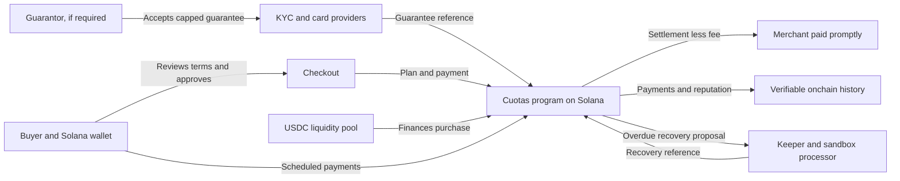

# Lazo

**Installment payments, built on Solana.**

Lazo uses Solana to make installment purchases clear, verifiable, and useful
in everyday commerce. A buyer sees the payment schedule and costs before
confirming. The base three-installment flow advances funds immediately, while the buyer's payments build
an onchain record that can unlock better terms over time.

When a purchase needs a guarantor, a family member or another trusted person
can accept a capped guarantee. Their card backs the obligation under the terms
they approved; it is not used to pay for the purchase. Identity checks and
card processing stay with external providers, while Solana records the plan,
payments, reputation progress, and a verifiable reference to the guarantee.

Lazo was made to turn crypto into practical payment infrastructure: stablecoin
settlement, transparent records, and programmable payment plans. The merchant
receives the buyer's initial payment and the pool's advance immediately, less
a 7% fee on the financed amount in that base flow. Each completed plan helps build a portable
reputation on Solana.

## Product decisions — October 7, 2026

Buyers choose **3 installments with no interest** or **6 installments with a
3% total interest on the financed amount** (available from US$350). An active
card guarantor is required for every plan and covers the full outstanding
principal **and agreed interest**; late penalties are excluded. Merchants choose
when they get paid: **7% today, 6.25% at 30 days, 5.75% at 60 days, or 5.25%
at 90 days**, always on the financed amount. Deferred payouts are released in
equal monthly tranches and guaranteed on their scheduled dates. The recovered business plan records a
4% origination fee on financed principal (included in the merchant fee) and
a 2% annual servicing fee paid by the pool; accrual rules remain pending.
Rationale and sensitivity analysis: [`proyecto/10-tasa-6-cuotas-y-cobro-diferido.md`](proyecto/10-tasa-6-cuotas-y-cobro-diferido.md).

**Where these terms run today.** The public web runs in the browser simulator
(mock mode). The new Anchor program source supports 3 and 6 installments, the
mandatory guarantor and principal-plus-interest coverage, merchant payout
terms, and the onchain payout schedule described below. The devnet upgrade is
pending approval: the binary deployed today is the previous program version.
No public purchase uses the new program yet. Marketplace merchants are examples;
there are no confirmed wallet partnerships or commercial traction.

Planning documents (internal, Spanish):
[`commercial decisions`](proyecto/06-decisiones-comerciales.md),
[`distribution and wallet alliances`](proyecto/07-go-to-market-y-alianzas.md),
[`retail economics and validation`](proyecto/08-minorista-y-economia.md),
[`pitch and demo preparation`](proyecto/05-pitch.md), and
[`H and selected improvements`](proyecto/09-alcance-opcion-h-y-mejoras.md).
Recovered business-plan models are historical scenarios, not current validated
pricing or returns. Guarantor discounts and an isolated, own-treasury simulation
are planned additions; no third-party funds or real-money DeFi are used.

Built at the Colosseum Crypto World's Fair — Superteam Argentina track.

> ## ⚠️ Devnet & sandbox only — no real money anywhere
>
> - **Solana devnet only** (the test network). Never mainnet. The frontend
>   refuses non-devnet RPC endpoints at runtime via a devnet genesis-hash
>   check (`app/src/lib/cuotas/real.ts`).
> - **devUSDC is a private test mint** — 6-decimal SPL token with **zero real
>   value**. It is not USDC.
> - **Didit (KYC) and Mobbex (cards) run in sandbox/test mode only.**
>   `MOBBEX_TEST_MODE` must be exactly `true`; anything else refuses to run.
> - The default frontend mode is a **browser mock**: it simulates the entire
>   product with no chain and no cards.
> - Seed phrases and private keys are never requested, shown, or stored in
>   this repo. Every transaction that signs or sends requires an explicit
>   operator approval.

## How Lazo works

1. **Choose a purchase.** At checkout, the buyer sees the initial payment,
   financed amount, payment dates, applicable costs, and any guarantor exposure
   before approving. The protocol configuration supplies business terms; the
   interface does not invent them.
2. **Accept a guarantee when required.** The guarantor reviews a clear maximum
   exposure, completes identity verification, and registers a card through the
   payment provider. Card details stay with the provider. The guarantor needs
   no Solana wallet.
3. **Approve the plan on Solana.** The buyer reviews the transaction in their
   wallet. The `cuotas` program checks the configured limits and guarantee,
   records the plan, and coordinates the pool advance. The merchant receives
   the purchase funds minus a fee on the financed amount: 7% if paid today,
   less if the merchant chooses to wait (mock only, see above).
4. **Make payments and build reputation.** Payments are made in USDC (the demo
   uses devUSDC). Each completed plan can advance the buyer's onchain reputation
   and improve terms for future purchases, such as the initial payment or
   available spending limit.
5. **Handle overdue plans transparently.** The program records overdue status
   according to configured dates. The keeper can propose a guarantor card
   recovery through the sandbox processor and register the verified recovery
   reference onchain. A default affects reputation and eligibility for another
   plan.

KYC and card processing happen offchain through their providers; Solana stores
the plan state, payment history, reputation, and a hash/reference for the
guarantee. Personal identity and card data are never written to the chain.



## Architecture

| Path | What lives there |
|---|---|
| `programa/` | Anchor 1.2 program `cuotas` — plan origination, installments, late crank, guarantor recovery, junior/senior LP pool, reputation, guarantee registry. Plus an independent LiteSVM acceptance suite in `programa/tests/`. |
| `app/` | Next.js App Router + TypeScript + Tailwind. `@solana/kit` + `@solana/kit-plugin-wallet` + `@solana/react`. All chain access goes through the single interface `app/src/lib/cuotas.ts` (mock or real implementation). |
| `app/src/generated/` | TypeScript client generated with Codama from the program IDL (`npm run generate`). |
| `app/src/app/api/fiador/` | Route handlers for the guarantor flow: HMAC invites, Didit sessions + signed webhook, Mobbex card sessions + re-queried webhook, server-side quote, verify-only registration. |
| `keeper/` | Node CLI loop: polls plans, writes **dry-run proposals only**; effects (mark-late crank, card charge, recovery registration, loss note) run solely via explicit `--execute` approval. Codama chain adapter + Mobbex gateway + idempotent journal. |
| `docs/` | Integration contracts (`docs/fiador-sandbox.md`). |
| `proyecto/` | Team process docs in Spanish — idea, validation, MVP, plan, pitch. |

## Quick start — mock mode (recommended for judges)

Requires Node.js 24.13+. No wallet, no chain, no credentials:

```sh
cd app
npm install
cp .env.example .env.local   # NEXT_PUBLIC_CUOTAS_MODE=mock is the default
npm run dev                  # http://localhost:3000
```

What to open (all simulated, all labelled devnet/demo):

| Route | What it shows |
|---|---|
| `/` | Landing: how Lazo works, the 3/6 options, merchant settlement and featured demo merchants |
| `/comercio` → `/comercio/<address>` → `/checkout/<product>` | Merchant marketplace: search, categories, 10 fictional demo merchants; each address opens its store (the glass window layout) and products go to checkout with the 3 / 6 installment selector |
| `/para-estudiantes`, `/para-comercios`, `/para-inversores` | Pages for students and families, merchants, and pool investors |
| `/app` | Account entry with a demo identity selector: `/app/estudiante`, `/app/comercio` (settlement terms, payout tranches and sales), `/app/comercio/mostrador` (QR/link orders), `/app/admin` |
| `/pool` | Junior/senior pool panel |
| `/fiador/<token>` | Guarantor invite and onboarding (100% principal and agreed-interest coverage) |
| `/orden/<id>` | Counter-sale order link and checkout |

The admin panel has a demo clock: advance it to watch a deferred sale settle
or an installment go late. Every page works at 390 px (phone) width.

## Quick start — real mode (devnet)

> **Honest status:** the real client is implemented and guarded, but the
> onchain protocol is not initialized yet — devnet runs the pre-lifecycle
> binary and the upgrade is pending. Reads and purchases fail closed (they
> error, never fake success). See [Known limitations](#known-limitations).

1. `cd app && npm install && cp .env.example .env.local`
2. Set `NEXT_PUBLIC_CUOTAS_MODE=real` and keep the devnet values from
   `.env.example` (program ID + devUSDC mint are already correct).
3. Set `NEXT_PUBLIC_CUOTAS_MERCHANT` to the demo-store merchant wallet — once
   `merchant_register` has run onchain. Without it the real purchase path
   fails closed instead of using the simulated mock address.
4. Connect a wallet (e.g. Phantom) set to **devnet**.
5. Protocol bring-up (operator-only, needs the deployer keypair + explicit
   per-transaction approval): runbook in
   [`programa/UPGRADE_DEVNET.md`](programa/UPGRADE_DEVNET.md), then seed via
   `cd app && npm run seed` (dry-run by default; `--send` asks for a global
   SEND and a YES per proposal, printing each exact transaction first).

Regenerate the Codama client after an `anchor build` of the program:
`cd app && npm run generate` (`npm run generate:check` verifies the committed
client matches the IDL — for CI).

## Environment variables

`app/.env.example` — copy to `app/.env.local` (never committed):

| Variable | Default in example | Purpose |
|---|---|---|
| `NEXT_PUBLIC_CUOTAS_MODE` | `mock` | Client mode: `mock` (local demo) or `real` (devnet). Any non-`real` value uses the mock. |
| `NEXT_PUBLIC_SOLANA_RPC_URL` | `https://api.devnet.solana.com` | Solana RPC. **Devnet endpoints only** — any other cluster is rejected at runtime. |
| `NEXT_PUBLIC_CUOTAS_PROGRAM_ID` | `E6pB2UER6PoXXQeuokWoVg4qd7WELMJxByhePcL6AQJQ` | Deployed `cuotas` program on devnet (see `programa/DEPLOYMENT_REPORT.md`). |
| `NEXT_PUBLIC_CUOTAS_USDC_MINT` | `8aLmRWDfWJSDUsF8a8BBqzfs4rJEZz2RbBminPVu9d9Y` | Private devUSDC mint on devnet (6 decimals, test token, no value). |
| `NEXT_PUBLIC_CUOTAS_MERCHANT` | _(commented out)_ | Demo-store merchant wallet on devnet. Without it, the real purchase path fails closed. |
| `CUOTAS_KEYS_DIR` | _(commented out)_ | Node scripts only (`scripts/seed.ts`): directory **outside the repo** (permissions 0700) holding test keypairs. Never a path inside the repo, never committed. |

The guarantor-sandbox and keeper variables (`FIADOR_*`, `DIDIT_*`, `MOBBEX_*`,
`KEEPER_*`) are documented, with their trust model, in
[`docs/fiador-sandbox.md`](docs/fiador-sandbox.md) — they also live in
`app/.env.local` and are never committed. No private key goes in any env file.

## Program behavior in source

The current Anchor source accepts **3 or 6 installments** from the configured
`plan_options`. Six installments carry 300 basis points (3%) total interest
and a configured minimum price; every plan requires an active guarantor, whose
coverage includes the remaining principal and agreed interest.

Reputation uses four configured tiers: **Tier 1 · Starter, Tier 2 · Steady,
Tier 3 · Trusted, and Tier 4 · Full**. The protocol applies the configured
down payment, purchase cap, and repayment rules at each tier; a higher tier
does not remove the guarantor requirement.

For merchant settlement, `open_plan` creates a `PayoutSchedule` PDA for each
plan. Immediate settlement transfers the net financed amount at once. Deferred
settlement leaves funds in the pool and records up to three monthly tranches;
anyone may call `release_payout(index)` after a tranche's release time. The
program releases each tranche once, reduces `Pool.committed_payouts`, and
transfers the scheduled amount to the merchant. New plans require enough free
pool liquidity for the current payout plus all outstanding commitments.

These behaviors describe the **new program source**, not the binary currently
running on devnet. The devnet upgrade is pending approval; the deployed binary
is the previous version. The public web runs in the simulator.

## What's real vs mock vs sandbox

| Component | Status |
|---|---|
| `cuotas` program source | **New source** — supports 3/6 installments, mandatory guarantor coverage including interest, and committed payout schedules. The devnet upgrade is pending approval; the deployed binary is the previous version. |
| devUSDC mint | **Real** — exists on devnet (supply 0, nothing ever minted), worthless test token. |
| Public web | **Simulator** — the public experience currently runs in mock mode; it does not use the new program source. |
| Frontend chain client | **Real client code** — `app/src/lib/cuotas/real.ts`: devnet genesis-hash guard, simulate-before-sign, fails closed on any inconsistency. |
| Codama client | **Generated client code** — generated from the new program IDL into `app/src/generated/`; devnet upgrade pending approval. |
| Keeper | **Real code, dry-run by default** — the loop only proposes; `--execute --approved-by --yes` per effect. Codama adapter guards devnet by genesis hash. |
| Didit KYC / Mobbex cards | **Sandbox code complete, never run live** — integration + webhooks implemented and tested; live checks are pending sandbox credentials (fail closed: `didit_not_configured`, `mobbex_live_refused`). |
| Frontend `mock` mode | **Mock** — default. Simulates the whole product (plans, late flow, reputation, pool, demo clock) in the browser. Clearly labelled; mock evidence never links to Solana Explorer. |
| Demo store, demo clock, reference prices | **Simulated** — declared in-product. |

## Tests

```sh
# Frontend — Vitest unit/integration + Playwright e2e
cd app
npm test                 # vitest run (src/**/*.test.ts*)
npx playwright install chromium   # once, for the e2e suite
npm run test:e2e         # playwright (mock mode; PW_CUOTAS_MODE=real for devnet)
npm run typecheck && npm run lint && npm run build

# Keeper — node:test unit suite (46 tests) + scripted-RPC e2e (9 tests)
cd keeper
npm test
npm run test:e2e         # real codecs against a scripted RPC transport
npm run typecheck

# Program — host unit tests (36) + LiteSVM acceptance suite (142)
cd programa
PATH="$HOME/.cargo/bin:$HOME/.local/share/solana/install/active_release/bin:$PATH" cargo-build-sbf --arch v1
cargo test -p cuotas --lib
cargo +stable test --manifest-path tests/Cargo.toml --no-fail-fast
cargo fmt --all -- --check && cargo clippy -p cuotas --all-targets -- -D warnings
```

**Never run `anchor test`** — the Anchor provider points at devnet and it
could attempt a deployment. The `[scripts] test` entry in
`programa/Anchor.toml` runs the two safe Cargo suites above: in-process only,
no validator, no deploy, no network.

## On-chain addresses (devnet)

| Item | Address |
|---|---|
| `cuotas` program (upgradeable) | [`E6pB2UER6PoXXQeuokWoVg4qd7WELMJxByhePcL6AQJQ`](https://explorer.solana.com/address/E6pB2UER6PoXXQeuokWoVg4qd7WELMJxByhePcL6AQJQ?cluster=devnet) |
| devUSDC mint (6 decimals, supply 0) | [`8aLmRWDfWJSDUsF8a8BBqzfs4rJEZz2RbBminPVu9d9Y`](https://explorer.solana.com/address/8aLmRWDfWJSDUsF8a8BBqzfs4rJEZz2RbBminPVu9d9Y?cluster=devnet) |

Deployment verification (byte-for-byte bytecode hash, transaction signatures,
funding log): [`programa/DEPLOYMENT_REPORT.md`](programa/DEPLOYMENT_REPORT.md).

## Known limitations

- **Devnet upgrade pending approval.** The new program source includes 3/6
  installment plans, mandatory guarantors, coverage of principal plus agreed
  interest, payout schedules, permissionless tranche release, and liquidity
  commitments. The binary currently deployed on devnet is the previous version.
  The public web runs in the simulator, so these new terms are not presented as
  an onchain purchase.

Full detail in [`programa/TEST_REPORT.md`](programa/TEST_REPORT.md) and
[`proyecto/handoff-demo-devnet.md`](proyecto/handoff-demo-devnet.md):

- **Devnet runs the previous program binary.** The new source and reviewed
  artifact include `open_plan` / `pay_installment` / `crank_mark_late` /
  `keeper_register_recovery` / `release_payout` and pass locally (142 LiteSVM +
  36 host tests), but the upgrade is pending approval
  ([`programa/UPGRADE_DEVNET.md`](programa/UPGRADE_DEVNET.md)).
- **Protocol state was never initialized** (`admin_init_config` / `pool_init`
  never ran; devUSDC supply is 0; no merchant registered). Until then the
  real client fails closed — errors, never fabricated data.
- **Didit/Mobbex live sandbox runs are pending credentials** — code and
  tests are done; no provider keys exist in this workspace, and the flows
  refuse cleanly without them.
- **Confirmed program gap:** a plan reopened within the same second can
  accept a stale quote (`opened_at` is the only generation guard). Low
  severity — pinned by a KNOWN-GAP test; fix is a generation discriminator.
- `admin_apply_loss` is a **provisional cash-loss simulation** under a
  trusted admin — not a real-credit write-off, and not a design for real
  funds. The business decision (cash vs credit write-off) is still open.
- Guarantor coverage policy (`FIADOR_COVERAGE_POLICY` A vs B) is a pending
  product decision — unset means `coverage_policy_pending`, fail closed.
- The buyer-side invite button still mints local mock links; server-side
  invite wiring is documented in `docs/fiador-sandbox.md`.
- Senior-tranche deposits and the devnet demo clock are outside the approved
  demo scope.

## Documentation

- [`programa/README.md`](programa/README.md) — program accounts, instructions, share pricing, accounting invariants, deployment status.
- [`programa/TEST_REPORT.md`](programa/TEST_REPORT.md) — 137+36 test evidence, adversarial coverage, confirmed gaps.
- [`programa/DEPLOYMENT_REPORT.md`](programa/DEPLOYMENT_REPORT.md) — devnet deployment record and verification.
- [`programa/UPGRADE_DEVNET.md`](programa/UPGRADE_DEVNET.md) — runbook for the pending upgrade + protocol init (Fase A3).
- [`docs/fiador-sandbox.md`](docs/fiador-sandbox.md) — guarantor flow contract: endpoints, env vars, trust model, keeper protocol.
- [`app/README.md`](app/README.md) · [`app/ACCOUNT_DEMO.md`](app/ACCOUNT_DEMO.md) — frontend notes.
- [`proyecto/`](proyecto/) — team process docs (Spanish): [`01-idea.md`](proyecto/01-idea.md), [`02-validacion.md`](proyecto/02-validacion.md), [`03-mvp.md`](proyecto/03-mvp.md), [`04-plan.md`](proyecto/04-plan.md), [`05-pitch.md`](proyecto/05-pitch.md), [`handoff-demo-devnet.md`](proyecto/handoff-demo-devnet.md) (authoritative current status).
- [`PRODUCT.md`](PRODUCT.md) — product definition, users, brand.

---

Hackathon prototype. Devnet test tokens only — no real funds, no real cards,
no production use.
