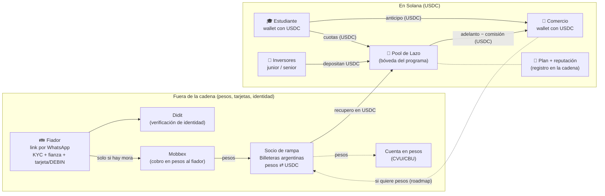
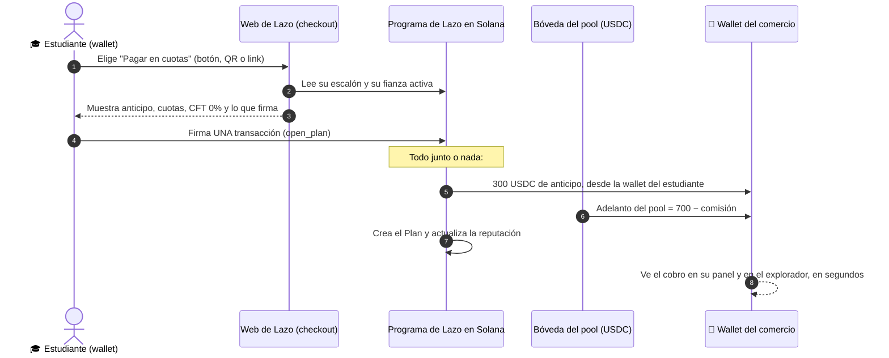
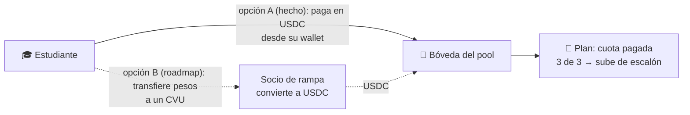
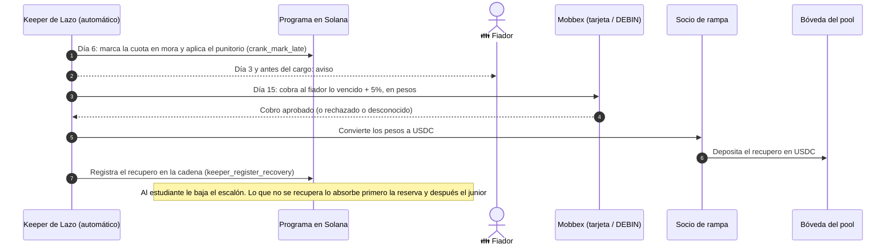
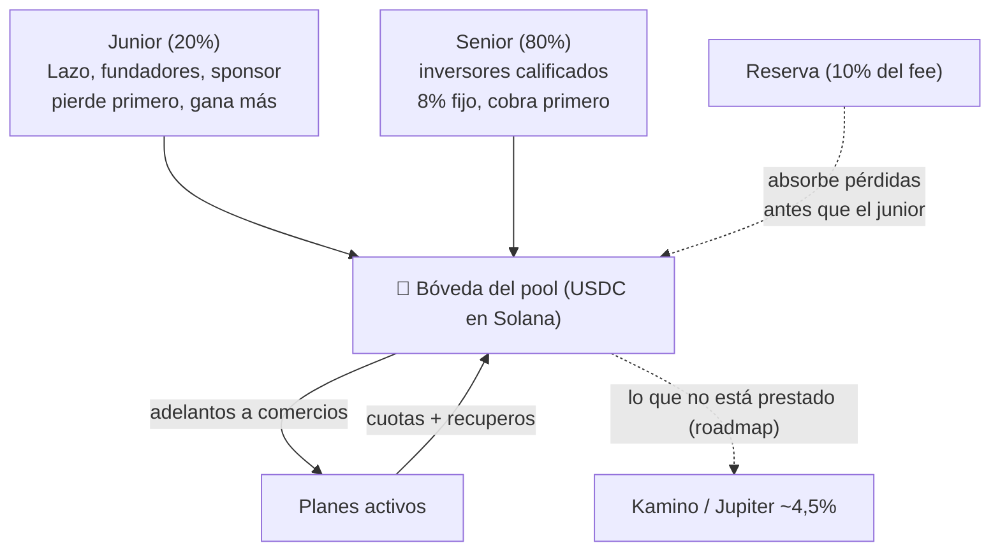

# Lazo: cómo se integra y por dónde se mueve la plata

**Fecha:** 6/10/2026 · Acompaña a `plan-de-negocio.md`. Responde las preguntas del equipo: ¿la gente se descarga una app?, ¿el comercio necesita un terminal tradicional?, ¿cómo paga el estudiante?, ¿cómo le llega la plata del pool al comercio?

**Todo lo que describe este documento corre hoy en devnet** (la red de prueba de Solana: las transacciones son reales, pero la plata es de mentira), con devUSDC, un token de prueba. Cada parte dice si está **hecha**, **simulada** o es **roadmap**.

Los diagramas son Mermaid: se ven en GitHub y en VS Code con la vista previa de Markdown.

---

## 1. La respuesta corta

1. **Nadie se descarga una app de Lazo.** Lazo es una web que se abre desde el celular con un link. El estudiante necesita una **wallet** (billetera digital que guarda sus USDC y firma las operaciones): hoy es Phantom; más adelante, una wallet que se crea con la cuenta de Google, sin descargar nada. El fiador y el comercio no necesitan wallet para empezar.
2. **El comercio no necesita terminal tradicional.** Online, pone un botón "Pagar en cuotas con Lazo" en su tienda. En el local, muestra un **QR** desde el celular. También puede mandar un **link de cobro** por WhatsApp.
3. **La compra es una sola transacción en Solana.** El estudiante la firma y, en el mismo momento:
   - su anticipo va al comercio;
   - el pool le adelanta al comercio el resto, menos la comisión;
   - queda registrado el plan en la cadena.
   O pasa todo junto o no pasa nada.
4. **Sí, entre estudiante, pool y comercio todo se mueve en USDC por Solana.** USDC es un dólar digital: 1 USDC ≈ 1 dólar. Esa es la parte que justifica la cadena: el comercio cobra en segundos, el inversor ve cada préstamo y el estudiante se lleva su historial.
5. **Los pesos aparecen en los bordes, fuera de la cadena:**
   - el fiador paga en pesos (tarjeta o DEBIN), solo si hay mora;
   - el estudiante podría pagar sus cuotas en pesos;
   - el comercio podría querer cobrar en pesos.
   Esas conversiones las hace un socio registrado (billeteras argentinas con rampa integrada). **Hoy eso es roadmap o está simulado.**

---

## 2. El mapa general

**Cómo leerlo:** las flechas llenas de la caja "En Solana" son las que pasan hoy en devnet. Lo de la caja de afuera ocurre en pesos, con socios, y vuelve al pool convertido a USDC. Las líneas punteadas son roadmap.

---

## 3. ¿Quién usa qué?

| Actor | ¿Descarga algo? | Qué usa | Cómo entra | Estado |
|---|---|---|---|---|
| **Estudiante** | Hoy, la wallet Phantom (app o extensión). No hay app de Lazo | La web de Lazo en el celular + su wallet | Conecta la wallet en el checkout | **Hecho** (devnet). Login con Google sin descargar nada (Phantom embedded): **roadmap** |
| **Fiador** | Nada | Un link que le manda el estudiante por WhatsApp | Abre el link, hace KYC con Didit, acepta la fianza con tope y carga la tarjeta o el DEBIN | **Código hecho**, falta la credencial del sandbox de Didit y Mobbex. En la demo se simula |
| **Comercio** | Nada. Sin terminal tradicional | Su panel web, desde el celular o la compu | Lazo lo registra (KYC del comercio) y él indica la wallet donde cobra | Panel **hecho**. Registro con KYC real: **roadmap** |
| **Inversor del pool** | Una wallet | El panel del pool | Deposita USDC en el tramo junior o senior | Junior **hecho**. Senior: **fuera de la demo** |
| **Lazo (empresa)** | — | El **keeper**: un programa automático que vigila los vencimientos y dispara la mora y el cobro al fiador | Corre en un servidor | **Hecho** (tests). En la demo, el reloj se adelanta |

**¿Y si después queremos una app?** Se puede hacer que la web se "instale" en la pantalla de inicio del celular, sin pasar por las tiendas de apps. Hoy no está hecho. Una app nativa no hace falta para el modelo.

---

## 4. Cómo cobra el comercio: tres canales, ninguno con terminal tradicional

| Canal | Cómo se ve | Cómo funciona por dentro | Estado |
|---|---|---|---|
| **Tienda online** | Botón "Pagar en cuotas con Lazo" en el checkout | El botón abre la web de Lazo con el producto y el precio. El estudiante conecta su wallet y firma | **Hecho** en la tienda demo. Tiendanube con "medio de pago personalizado" (sin aprobación) y plugin de WooCommerce: **roadmap** |
| **Local físico** (comercio cerca de la facultad) | El vendedor carga el precio en su panel y aparece un **QR** en su celular. El estudiante lo escanea con su wallet | Es un **Solana Pay "transaction request"**, un estándar de Solana para pagar con QR. La wallet le pide la transacción al servidor de Lazo, el estudiante la ve (destino, monto, red) y la firma. El vendedor ve el "pagado" en su panel al instante | **Roadmap** (investigado en `research/c` §3, no construido) |
| **Link de cobro** | El comercio manda un link por WhatsApp o Instagram | Es el mismo checkout de la tienda online, con el producto y el precio ya cargados | **Roadmap** (es reutilizar el checkout) |

**Por qué no hace falta terminal tradicional:** un terminal tradicional sirve para leer una tarjeta, y nuestro estudiante no tiene tarjeta. Lo que hace falta es que el estudiante firme desde su wallet, y para eso alcanza un QR o un link. Para el comercio, eso también es un ahorro: no paga alquiler de terminal tradicional.

---

## 5. La compra paso a paso (PC de US$1.000, escalón 0)

Escalón 0: anticipo 30% y 3 cuotas.

**Cuánto recibe cada uno en ese momento:**

| | Hoy en el programa (7% de lo financiado) | Con el precio propuesto (9% del precio, `plan-de-negocio.md` §3.4) |
|---|---|---|
| Anticipo del estudiante → comercio | 300 | 300 |
| Adelanto del pool → comercio | 651 | 610 |
| **Total que cobra el comercio, al instante** | **951** (paga 49 = 4,9% del precio) | **910** (paga 90 = 9% del precio) |
| Lo que sale del pool | 651 | 638 (610 al comercio + 28 de originación a Lazo, 4% de lo financiado, `plan-de-negocio.md` §7.3) |
| Lo que el pool espera cobrar | 700 en 3 cuotas de 233,33 | 700 en 3 cuotas de 233,33 |

Hoy el programa deja toda la comisión en el pool. Separar la parte de Lazo (originación) es un cambio de `ProtocolConfig` y del programa, **pendiente de la decisión D1**.

**Qué ve el estudiante antes de firmar:** destino, monto, token (USDC) y red (devnet). Nunca se le pide la frase semilla.

---

## 6. Las cuotas

- **Opción A, hecho:** el estudiante entra a su panel y paga la cuota en USDC (`pay_installment`). Si es la última, el plan se cierra y sube de escalón.
- **Opción B, roadmap:** el estudiante transfiere pesos a un CVU, el socio los convierte al tipo del día y deposita USDC en el pool. La cuota está fija en USDC, así que si el peso se devalúa, en pesos sale más cara (decisión Q16). El spread de ~1% es una línea de ingreso (`plan-de-negocio.md` §7).
- **Débito automático, roadmap:** Solana permite que el estudiante autorice al programa a cobrarle hasta un tope. Es cómodo, pero el estudiante lo puede revocar cuando quiera: no es una garantía. La garantía es el fiador.

---

## 7. Si el estudiante no paga: el cobro al fiador

- **Es el único momento en que Lazo toca pesos.** Por eso conviene que la conversión la haga un socio registrado y que el medio de cobro principal sea **DEBIN** (débito a la cuenta del fiador): cuesta menos que la tarjeta y no tiene contracargo (`plan-de-negocio.md` §6.2).
- **Estado:** el programa y el keeper están **hechos** y probados. El cobro real con Mobbex tiene el código listo, pero **falta la credencial del sandbox**. La conversión a USDC está **simulada**.

---

## 8. El pool: de dónde sale la plata que se le adelanta al comercio

- Los inversores depositan USDC y reciben una participación (`lp_deposit`). Cada adelanto, cuota, recupero y pérdida se ve en la cadena.
- **En la hackathon:** el pool es tesorería de prueba en devnet. **En producción:** primero tesorería propia o de un sponsor. El senior solo se abre a inversores calificados o del exterior, **nunca al público argentino** (`plan-de-negocio.md` §9).

---

## 9. El comercio y los pesos

El comercio cobra **USDC en su wallet de Solana**. Si quiere pesos, hay dos caminos:

| Camino | Cómo | Quién lo hace | Estado |
|---|---|---|---|
| **1. Lo convierte él** | Manda los USDC a su cuenta de billeteras argentinas con rampa integrada (las tres aceptan USDC por Solana, `research/c` §4), los vende y retira a su CVU | El comercio | Posible hoy en mainnet. Fuera del producto |
| **2. Lazo se lo deposita en pesos** | Lazo, con un socio (por ejemplo, la API del socio de rampa que retira a CVU), le manda pesos directo a su cuenta. Se cobra un spread | Socio de rampa registrado | **Roadmap**, cuando haya volumen. Fuera del MVP (`03-mvp.md`) |

**Lo que falta validar:** que el comercio acepte cobrar en USDC o con conversión a pesos (supuesto #2 de `02-validacion.md`). Hoy es una creencia: no hay ningún comercio con nombre.

---

## 10. Qué va en la cadena y qué no

| En Solana (USDC, verificable) | Fuera de la cadena |
|---|---|
| Depósitos y retiros del pool | KYC del estudiante, del fiador y del comercio (Didit) |
| La compra: anticipo y adelanto al comercio | Cobro al fiador en pesos (Mobbex: tarjeta o DEBIN) |
| Cuotas pagadas en USDC | Conversión pesos ⇄ USDC (socio de rampa) |
| El plan: monto, vencimientos, mora y recupero | El PDF de la fianza (en la cadena va solo su hash, una huella que prueba que no cambió) |
| Reputación: escalón y contadores, **nunca qué compró** | Integración con Tiendanube o WooCommerce |
| Reglas de negocio (`ProtocolConfig`) | Avisos al fiador (WhatsApp o mail) |

---

## 11. Fricciones a resolver antes de producción

| Fricción | Qué pasa hoy | Cómo se resuelve |
|---|---|---|
| **El estudiante necesita USDC para el anticipo** | En devnet, se le da devUSDC de prueba | Comprar USDC en billeteras argentinas, o pagar el anticipo en pesos por CVU con un socio (roadmap) |
| **El estudiante necesita SOL para pagar la comisión de red** (fracciones de centavo por transacción) | El estudiante paga la comisión de cada transacción con SOL de prueba | Que Lazo pague la comisión de red por él (Solana lo permite). El costo ya está contemplado en el modelo (KYC + gas, US$1 por plan) |
| **Descargar una wallet** | Phantom | Wallet con cuenta de Google (Phantom embedded), sin descargar nada |
| **El comercio no conoce USDC** | Ve el cobro en su panel | Depósito en pesos con un socio (§9) |
| **El fiador desconoce el cargo** | Tarjeta en sandbox | DEBIN como rail principal y fianza firmada como respaldo legal |

---

## 12. Hoy en la demo vs. en producción

| Pieza | Demo (devnet) | Producción |
|---|---|---|
| Dinero | devUSDC (token de prueba propio) | USDC real, **solo después de la hackathon y con estructura legal** |
| Canal del comercio | Tienda demo propia con botón | Botón, QR en el local, link de cobro, Tiendanube |
| Wallet del estudiante | Phantom | Wallet con cuenta de Google + Lazo paga la comisión de red |
| Fiador | KYC y tarjeta con código listo, simulado hasta tener credenciales del sandbox | Didit + DEBIN (principal) + tarjeta (respaldo) |
| Paso del tiempo | Reloj de demo que adelanta días | Tiempo real, keeper en un servidor |
| Pesos | Simulados | Socio de rampa registrado |
| Pool | Tesorería de prueba, solo junior | Tesorería propia o sponsor; senior solo para calificados |
