# Lazo: el negocio en 5 minutos (v3)

> **Nota de actualización a v3 (2026-10-07):** Este documento fue reescrito sobre el modelo financiero vigente [`modelo-v3.py`](modelo-v3.py) (salida en [`salida-modelo-v3.md`](salida-modelo-v3.md)) y los gráficos actualizados en [`graficos/`](graficos/).
> **Principales cambios respecto de v2:**
> 1. **Política comercial vigente:** se adopta la comisión base del 7% sobre lo financiado para cobro inmediato (hoy), y el cobro en tramos mensuales a 30 días (6,25%), 60 días (5,75%) y 90 días (5,25%), garantizados onchain con verificación de liquidez libre. Se descartan las tarifas preliminares de 9% y 10%.
> 2. **6 cuotas definidas:** 3% total sobre lo financiado para compras desde US$ 350; 3 cuotas sin interés y sin mínimo de compra.
> 3. **Fiador obligatorio:** fianza obligatoria al 100% de capital + interés en todos los tiers (Tier 1 a 4). Los punitorios por mora quedan fuera de la fianza. Se elimina la idea 11 ("descuentos comerciales para el fiador al día").
> 4. **Venta en mostrador en el MVP:** link y código QR propio para compras presenciales en mostrador.
> 5. **Cumplimiento de reglas de hackathon:** no se nombran competidores comerciales ("la competencia", "la alternativa bancaria tradicional").
> 6. **Rotulado de hipótesis:** todos los números corresponden a escenarios de calibración del modelo, nunca a métricas medidas de Lazo.

**Para leer rápido y evaluar la viabilidad.** Cada bloque contiene un titular, un gráfico generado, los puntos clave y **qué revisar**.

**Todo es un escenario hipotético, no un pronóstico garantizado.** No hay usuarios, comercios ni inversores reales todavía, y el MVP opera en devnet (red de pruebas de Solana, con fondos sin valor económico).

---

## 1. Lazo se queda con US$ 3,4 de cada US$ 100 vendidos, en línea con la industria global

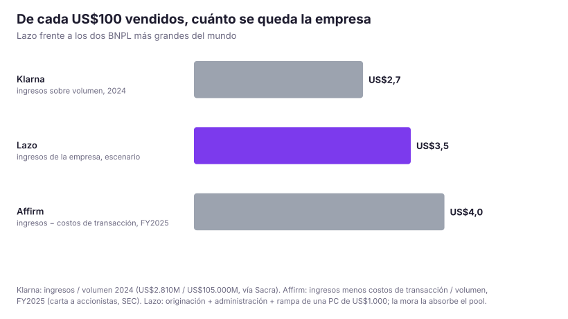

- **Decidido por el equipo (reparto D8):** la remuneración de Lazo se compone de **4% de originación sobre el capital financiado** (descontado de la comisión comercial) más **2% anual de administración sobre el saldo vivo**, abonado por el pool.
- En una compra típica de US$ 1.000 con 30% de anticipo (US$ 700 financiados), Lazo percibe **~US$ 34**: US$ 28 de originación, US$ 2,33 de administración a 3 cuotas y ~US$ 4 por intermediación de rampa ARS/USDC. Descontando costos variables directos (verificación de identidad KYC, red Solana y adquisición unitaria), restan **~US$ 26 a US$ 28 limpios por operación**.
- **Comparativa internacional:** Klarna percibe ~US$ 2,7 por cada US$ 100 de volumen (ingresos netos 2024 vía Sacra) y Affirm ~US$ 4,0 tras costos de transacción (FY2025 SEC). Las fintech de cuotas no buscan margen por transacción unitaria sino **escala, rotación y recompra**.
- **Lazo no arriesga su propio balance para prestar:** el capital del crédito lo aportan los proveedores de liquidez del pool. Lazo cobra por originar, calificar, cobrar y gestionar la recuperación.

**Qué revisar:** la comparación internacional es referencial. Affirm descuenta fondeo y pérdidas en su métrica, mientras que en Lazo el riesgo crediticio lo asume el pool de liquidez.

---

## 2. La comisión del comercio es una torta compartida con el inversor

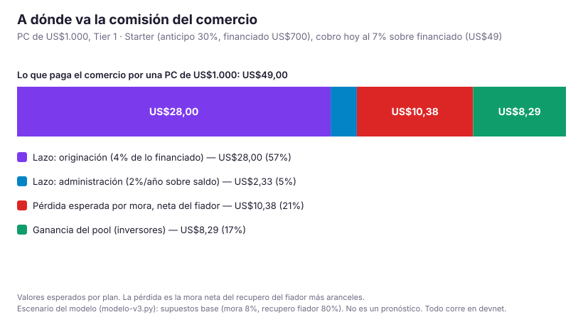

- En una venta de US$ 1.000 con cobro inmediato (7% sobre US$ 700 financiado), el comercio paga **US$ 49 de comisión total**.
- De esos US$ 49:
  - **US$ 28,00** van a Lazo por originación (4% del financiado).
  - **US$ 2,33** van a Lazo por administración (2% anualizado).
  - **US$ 10,38** cubren la pérdida esperada por mora no recuperada (escenario base de 8% de atraso y 80% de recupero efectivo).
  - **US$ 8,29** constituyen el rendimiento neto para los inversores del pool.
- Si Lazo pretendiera cobrar 6% de originación en lugar de 4%, el pool quedaría sin retorno atractivo y los inversores retirarían la liquidez.
- **Vías para expandir el margen de Lazo sin restar atractivo al inversor:**
  1. **Control del recupero del fiador:** mantener la efectividad de cobro sobre la tarjeta del fiador por encima del 80%.
  2. **Recompra del estudiante:** al avanzar de Tier (Tier 1 a Tier 4), el costo de adquisición unitario se amortiza entre múltiples compras.
  3. **Incorporación de 6 cuotas al 3%** en tickets superiores a US$ 350.
  4. **Participación propia en el tramo junior** (ver sección 4).

**El recupero queda íntegramente en el pool:** todo cobro al fiador ante mora ingresa directamente a la liquidez del pool rindiendo para los inversores (`keeper_register_recovery`), no para la empresa.

---

## 3. Lazo alcanza el punto de equilibrio en el mes 15 con ~550 ventas mensuales

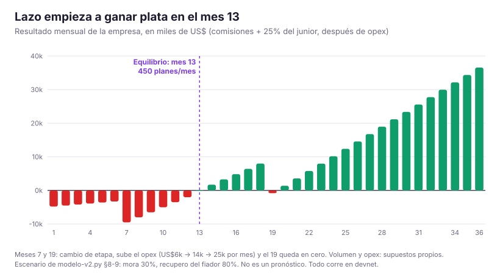

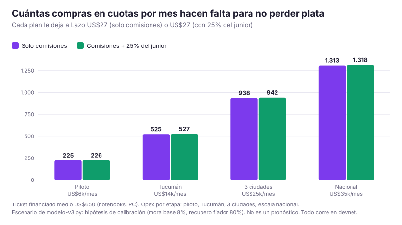

- Con el reparto vigente, cada plan genera para Lazo **~US$ 28 netos** solo por comisiones de servicio, o **~US$ 31** si la empresa coinvierte en el 25% del tramo junior.
- Para absorber el opex presupuestado por etapa se requieren:
  - Piloto (opex US$ 6.000/mes): ~190 a 210 planes/mes.
  - Tucumán y segunda plaza (opex US$ 14.000/mes): ~450 a 500 planes/mes.
  - Escala multiciudad (opex US$ 25.000/mes): ~800 a 900 planes/mes.
- En la proyección del modelo, el equilibrio operativo mensual (EBITDA >= 0) se produce en el **mes 15**, alcanzando 550 planes originados en ese mes.

**Qué revisar:** la curva de adopción y el presupuesto operativo son hipótesis de modelado. Alcanzar 550 compras mensuales en el primer año exige validación en calle con los comercios adheridos.

---

## 4. Ronda de financiamiento: ~US$ 290k para alcanzar la rentabilidad

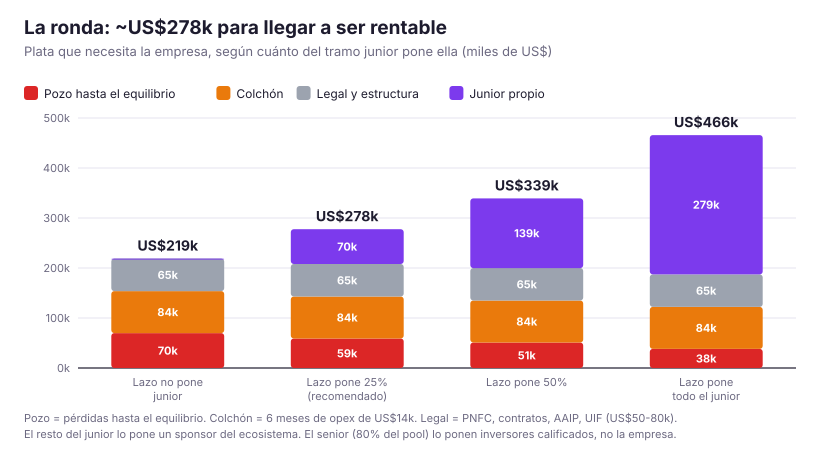

| Rubro | Importe estimado | Justificación |
|---|---:|---|
| Pérdidas acumuladas hasta el equilibrio | US$ 71.126 | Déficit operativo de los primeros 14 meses de operación |
| Colchón de contingencia | US$ 84.000 | 6 meses de opex de etapa 2 (US$ 14k/mes) ante demoras comerciales |
| Estructura legal y licencias | US$ 65.000 | Registro BCRA (PNFC), contratos marco, cumplimiento AAIP/UIF y estructura off-shore |
| Tramo junior propio (25%) | US$ 69.672 | Coinversión de Lazo en la primera pérdida del pool (al mes 18) |
| **Total de la ronda** | **~US$ 289.800** | Fondea la empresa hasta la autosuficiencia operativa |

- El capital restante del pool se estructura con terceros: un **sponsor institucional** fondea el 75% del tramo junior (~US$ 209k al mes 18) e **inversores calificados** fondean el tramo senior (~US$ 1,1M).
- Si Lazo no aportara capital en el tramo junior (0%), la ronda necesaria sería de **~US$ 218k**, pero perdería alineación con los inversores del pool.

---

## 5. Estructura de tramos del pool: Senior protegido y Junior de primera pérdida

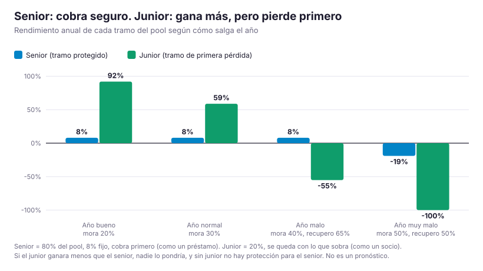

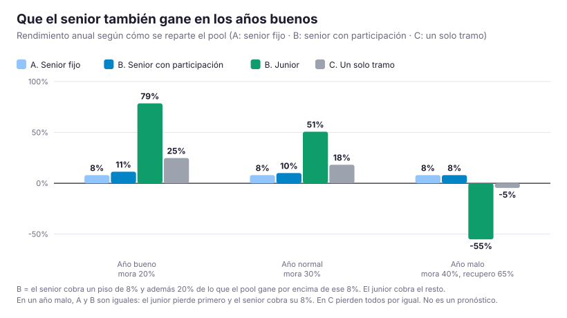

El pool segrega el riesgo de capital en dos tramos diferenciados:

| Característica | Tramo Senior (80% del pool) | Tramo Junior (20% del pool) |
|---|---|---|
| Perfil de inversor | Inversor conservador / institucional | Fundadores, Lazo y sponsor estratégico |
| Prioridad de cobro | **Preferente (cobra primero)** | Subordinado (cobra el remanente) |
| Absorción de pérdidas | Protegido hasta agotar el junior | **Primera pérdida:** absorbe el 100% del quebranto inicial |
| Retorno objetivo | **8,0% anual fijo** | Variable (objetivo 18% a 25% en régimen normal) |

En el escenario base (mora 8%, recupero 80%), el tramo senior percibe su 8,0% garantizado con holgura. En escenarios de estrés severo, el junior actúa como escudo protegiendo el capital senior.

---

## 6. Liquidez del pool y política de retiros

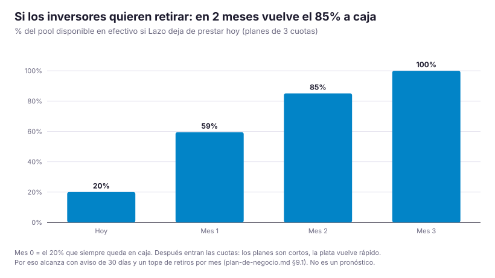

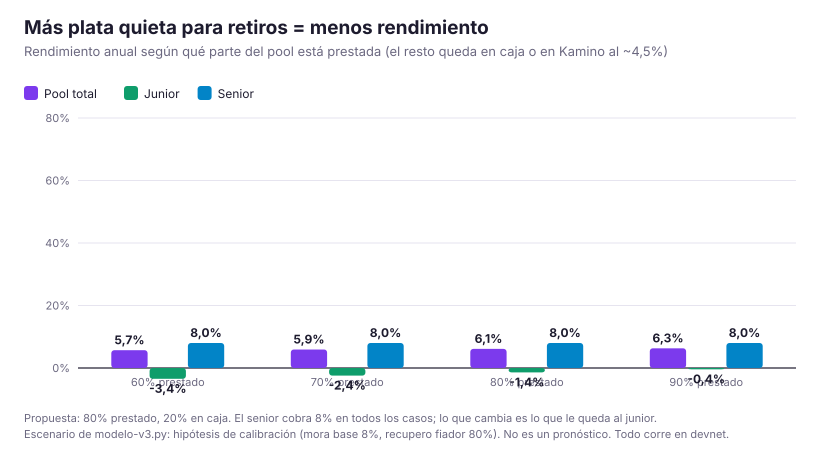

- **Plazos cortos de rotación:** al tratarse de financiamiento a 3 y 6 meses, si el protocolo detuviera la originación, **el 59% del capital retorna a caja en 30 días y el 85% en 60 días**.
- **Parámetros de liquidez propuestos:**
  - Plazo mínimo de permanencia: 3 meses para el senior; 6 meses para el junior.
  - Preaviso de rescate: 30 días (senior) y 60 días (junior).
  - Límite de retiro mensual: hasta 20% del valor total del pool por mes para evitar tensiones de caja.
  - Utilización objetivo: 80% prestado y 20% en reserva líquida / protocolos de bajo riesgo en Solana (Kamino al ~4,5%).

---

## 7. Esquema de tarifas al comercio: cobro inmediato vs. cobro en tramos

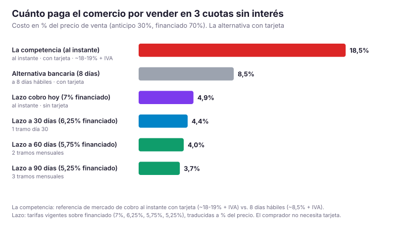

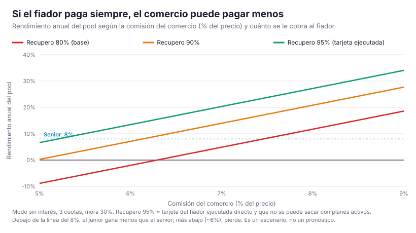

Frente a las alternativas del mercado, Lazo ofrece al comercio elegir entre cuatro plazos de cobro sobre el monto financiado:

| Modalidad | Comisión s/ financiado | Costo sobre precio (30% anticipo) | Calendario de cobro | Ventaja competitiva |
|---|---:|---:|---|---|
| **Cobro hoy** | **7,00%** | **4,90%** | 100% al abrir (t=0) | Muy por debajo del cobro al instante con tarjeta |
| **30 días** | **6,25%** | **4,38%** | 100% el día 30 (1 tramo) | Ahorro de 75 bps de comisión |
| **60 días** | **5,75%** | **4,03%** | 50% día 30 · 50% día 60 | Pagos en tramos mensuales alineados |
| **90 días** | **5,25%** | **3,68%** | ⅓ día 30 · ⅓ día 60 · ⅓ día 90 | El costo más bajo para el comercio |

**Comparación con el mercado:**
- La competencia con tarjeta y cobro inmediato cobra entre ~18% y 19% + IVA por 3 cuotas.
- La alternativa bancaria tradicional cobra ~8,5% + IVA pero exige 8 días hábiles de espera, alquiler de terminal y que el cliente posea tarjeta.
- Lazo permite cobrar en el día al 4,9% del precio (o al 3,7% en 90 días) **vendiendo a estudiantes que no cuentan con tarjeta**.

---

## 8. Límites de exposición y venta en mostrador en el MVP

- **Límite unificado por fianza:** el estudiante puede operar bajo su fianza activa hasta el límite asignado por su Tier (Tier 1 hasta US$ 1.000; Tier 4 hasta US$ 1.500). La suma de saldos pendientes no puede exceder la cobertura autorizada por el fiador.
- **Venta en mostrador por QR:** el comercio genera una orden con importe y descripción (`/app/comercio/mostrador`) produciendo un código QR propio en SVG. El estudiante escanea el QR con su teléfono y aprueba el pago en 3 o 6 cuotas reutilizando su fianza ya registrada (`/orden/[id]`).

---

## Principales riesgos y supuestos a validar en el piloto

1. **Recupero real del fiador ($r$):** el modelo asume 80% de cobro efectivo ante atraso del estudiante. Si cae por debajo del 66%, el tramo junior absorbe pérdidas.
2. **Tasa de atraso inicial ($d$):** hipótesis base de 8% de atraso que requiere gestión de cobro al fiador.
3. **Adopción de plazos en tramos:** verificar qué proporción de comercios prefiere esperar 30, 60 o 90 días para reducir su comisión del 7% al 5,25%.
4. **Costo de adquisición de clientes (CAC):** supuesto de US$ 5 por plan que depende de la recurrencia de compras del estudiante dentro de su Tier.
