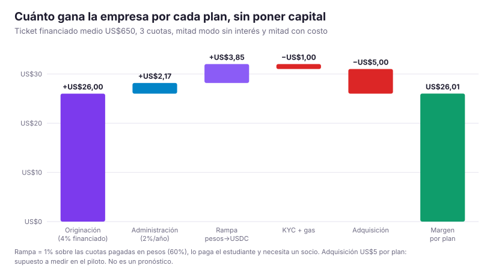
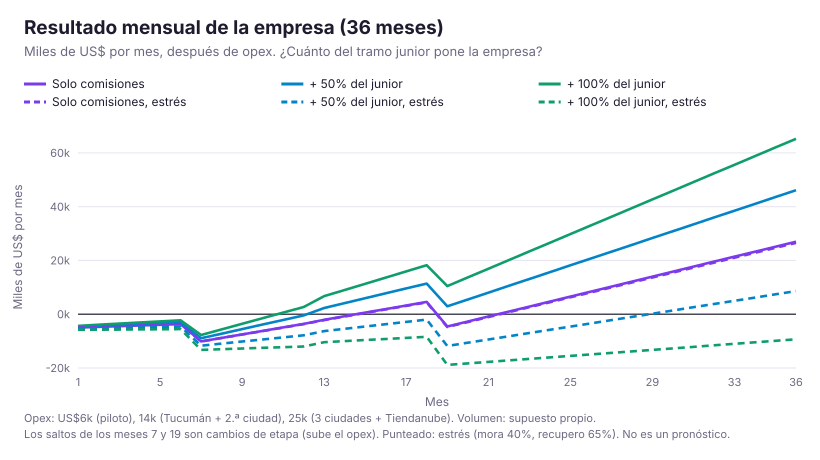
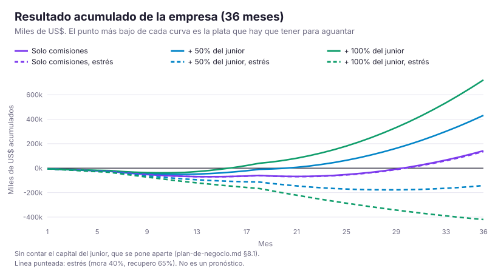
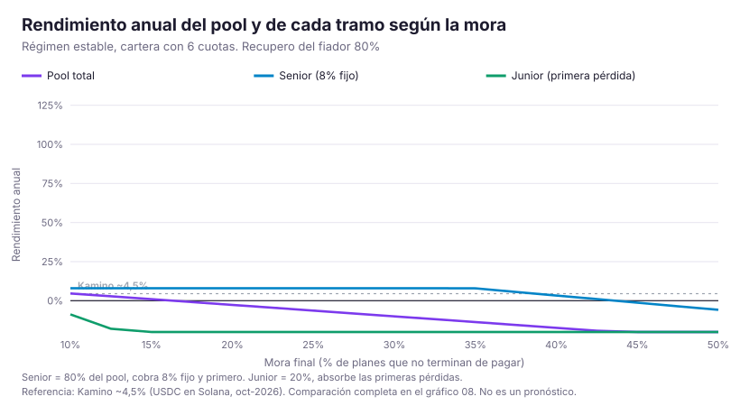
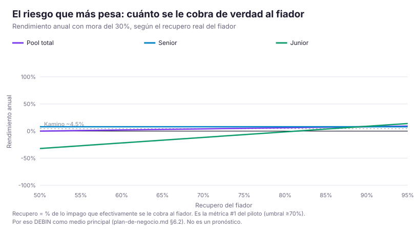
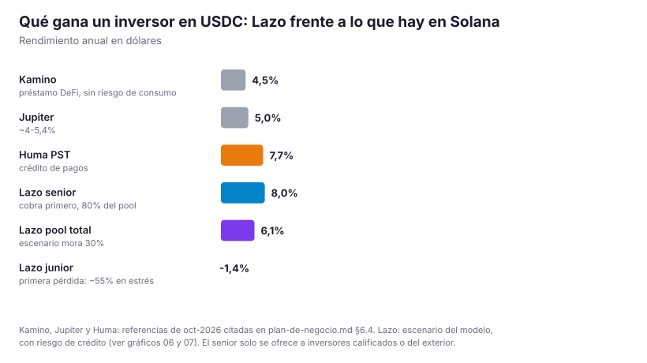

# Lazo: plan de negocio para que sea rentable

**Fecha:** 6/10/2026 · **Estado del proyecto:** MVP funcionando en **devnet** (la red de prueba de Solana: las transacciones son reales, pero la plata es de mentira) con devUSDC, un token de prueba. **No hay usuarios, comercios ni inversores reales.** Todo número de este documento es un escenario con los supuestos a la vista. No es un pronóstico.

**De dónde sale:** leí todo `proyecto/` (validación rondas 1-4, research a-f, MVP, PRODUCT, pitch y los 7 archivos de `06-viabilidad/`). Volví a correr el modelo financiero, le encontré un error y armé `modelo-v2.py` (corregido y extendido). Su salida completa está en `salida-modelo-v2.md`. Para reproducir cualquier número: `python3 modelo-v2.py`.

**Cómo leerlo:** si tenés 5 minutos, leé §1 y §3. Si vas a hablar con un inversor, sumá §5-§8. Si vas a tocar la landing o el pitch, andá directo a §13. **Versión de 5 minutos con gráficos, estilo pitch:** `pitch-negocio.md`. Para entender cómo paga cada uno y por dónde se mueve la plata (app, QR, USDC, pesos), leé `integracion-y-flujo-del-dinero.md`.

---

## Índice

1. [El resumen en una página](#1-el-resumen-en-una-página)
2. [Qué encontré al leer todo](#2-qué-encontré-al-leer-todo-lo-nuevo-respecto-de-06-viabilidad)
3. [El esquema de precios recomendado](#3-el-esquema-de-precios-recomendado-el-comercio-elige)
4. [La escalera v2](#4-la-escalera-v2-qué-gana-cada-uno-al-subir)
5. [Flujos de caja por actor](#5-flujos-de-caja-por-actor-caso-pc-de-us1000)
6. [El plan para cada actor](#6-el-plan-para-cada-actor)
7. [Cómo gana plata la empresa](#7-cómo-gana-plata-la-empresa)
8. [Proyección a 36 meses y cuánta plata hace falta](#8-proyección-a-36-meses-y-cuánta-plata-hace-falta)
9. [Estructura del pool y legal por etapas](#9-estructura-del-pool-y-legal-por-etapas)
10. [Otras ideas para sumar](#10-otras-ideas-para-sumar)
11. [Salida al mercado](#11-salida-al-mercado-go-to-market)
12. [Métricas y reglas de corte, y qué hacer si no cierra](#12-métricas-reglas-de-corte-y-qué-hacer-si-no-cierra)
13. [Qué cambiar en la landing, el pitch y el video](#13-qué-cambiar-en-la-landing-el-pitch-y-el-video-para-después)
14. [Decisiones que tiene que tomar el equipo](#14-decisiones-que-tiene-que-tomar-el-equipo)
15. [Fuentes y método](#15-fuentes-y-método)
16. [Gráficos: empresa, pool e inversores](#16-gráficos-empresa-pool-e-inversores)

---

## 1. El resumen en una página

**Veredicto: el negocio es viable.** El producto está bien pensado: formaliza algo que la gente ya hace ("prestame la tarjeta"), el fiador hace que el riesgo sea financiable, y el comercio cobra al instante a un costo menor que las alternativas que verificamos. Con el esquema de precios que hay hoy no cierra del todo, pero se arregla con ajustes de configuración, no con un rediseño.

**Las tres cosas más importantes:**

1. **Hoy el pool apenas le paga al inversor y la empresa no cobra nada.** Con 0% al estudiante y 7% del comercio, todo para el pool, el libro rinde ~9%/año con mora del 30%. El senior cobra su 8% justo y al junior le queda ~10%, poco para quien pone la primera pérdida. La empresa tiene ingresos cero.
2. **La solución que propongo: "el comercio elige"**, como ya pasa en Argentina con las cuotas con tarjeta:
   - **Modo sin interés:** el comprador paga 0% y el comercio paga 10% de lo financiado (7% del precio en el escalón 0).
   - **Modo con costo:** el comprador paga 8% de lo financiado (~5,6% real sobre el precio, contra ~29% en Mercado Pago) y el comercio paga solo 3% (2,1% del precio).
   - En los dos modos el libro rinde ~14-15%/año con mora del 30%, el senior cobra 8% con margen, el junior ~28-34% y la empresa cobra 2-3% de originación.
   - Mantiene el "0% de interés" del pitch donde el comercio lo paga (con cláusula anti-recargo, que la ley exige).
   - **Ajuste posterior (§3.4):** comparando con banco y Mercado Pago, conviene fijar el modo sin interés en **9% del precio + IVA, cobro al instante** ("precio de banco, velocidad de Mercado Pago"). Frente al H1 del 7%, casi duplica lo que gana el proyecto por plan (US$24 → US$42) y baja el equilibrio de ~840 a ~470 planes/mes.
3. **La plata grande no está en el fee: está en ser dueño del tramo junior.** Por plan, la empresa gana poco (US$4-17 después de costos). Si además pone la primera pérdida del pool, se queda con el spread entero: el pool rinde ~17,5%/año en régimen estable, el senior se lleva 8% y el junior ~55%. Es el modelo de Affirm y Credix: originar, administrar y poner la primera pérdida. Con eso, la empresa cubre un opex de US$20k/mes con ~870 planes por mes (ticket medio US$650), o con ~500 si suma 6 cuotas y recompra.
   - **Actualizado (§7.3):** la empresa no puede depender solo del junior. Con **originación del 4% + administración del 2%/año**, gana **US$26 por plan sin poner capital** y llega al equilibrio mensual en el mes 15. Además pone 25-50% del junior para alinearse con los inversores. Gráficos en §16.

**El riesgo que define todo** no es el precio. Es **cuánto se le recupera de verdad al fiador** (`r`). Con tarjeta, si muchos fiadores desconocen el cargo (en Argentina, 83-86% de los desconocimientos se resuelven a favor del titular, según el informe PUSF 2025 del BCRA), el libro pasa de +14% a +3% o a negativo. Por eso: **DEBIN o débito a CBU como rail principal del fiador**, la tarjeta como respaldo, y medir `r` en el piloto antes de escalar.

**Qué hace falta para arrancar:** un piloto con 2-3 comercios y ~100 planes, fondeado con tesorería propia o de un sponsor (~US$60-150k de pool). Una ronda semilla de **~US$400-500k** cubre 18 meses: junior, opex, legal (PNFC + estructura) y colchón. Ver §8.

---

## 2. Qué encontré al leer todo (lo nuevo respecto de `06-viabilidad`)

`06-viabilidad/` es un buen trabajo y la mayoría de sus conclusiones se sostienen. Estas son las cosas que cambian o se agregan:

| # | Hallazgo | Qué cambia |
|---|---|---|
| 1 | **El modelo v1 tenía un error que hacía ver peor al esquema B.** Contaba dos veces el fee de la empresa en lo que desembolsa el pool (679 en vez de 665 en la PC de US$1.000) y, al revés, no le descontaba al pool el servicing que cobra la empresa | Corregido, el esquema B (6% al estudiante, 7% al comercio) rinde **21%/año** con mora del 30%, no 16%. Su mora de equilibrio sube de 53% a 60%. El esquema A (actual) no cambia: 9,3% |
| 2 | **La empresa sola gana muy poco por plan.** Con A=US$500 financiados, los fees dejan ~US$13 por plan y los costos variables (KYC, gas, adquisición) son ~US$9 | La empresa no se sostiene solo con fees. Tiene que **poner el junior**, subir el ticket medio, sumar 6 cuotas y bajar la adquisición con recompra. Ver §7 |
| 3 | **Cómo se reparte el fee entre pool y empresa no cambia la economía total si la empresa pone el junior.** Pasar la originación de 2% a 3% saca plata del junior y la pone en fees: el total es el mismo | El reparto importa cuando el junior lo ponen **terceros** (sponsor, avaladores). Ahí sí hay que negociarlo |
| 4 | **"La fianza baja con el escalón" no es verdad si baja el anticipo y la cobertura queda alta.** Con menos anticipo, el monto financiado sube, y con eso la exposición del fiador: con la escalera actual va de 73,5% a ~75,6% del precio, y con piso de cobertura del 90%, a 85% | Hay que elegir: o el premio del fiador es otra cosa (menos probabilidad de que le cobren, transparencia, tope fijo que firma una sola vez), o se mantiene un anticipo mínimo. Propuesta en §4 |
| 5 | **Bajar el interés por escalón (6→3%) pierde plata en los escalones altos si la mora no baja.** Pasa en los dos modos | Los descuentos por escalón se activan **con datos**, no de entrada. Se gobiernan desde `ProtocolConfig` |
| 6 | **El tramo sin fiador pierde a cualquier mora razonable**: −US$9 por plan con mora del 30%, +US$1 con mora del 10% | Se mantiene solo como costo de adquisición acotado (tope US$150) y dentro del junior. Si no convierte a "con fiador", se saca |
| 7 | **El rail de cobro al fiador pesa más que el precio.** Con tarjeta y 20% de desconocimientos, el libro cae de 13,7% a 3,3%. Con recupero del 60%, da −7,9% | DEBIN o CBU como rail principal (costo ~1%, sin contracargo de tarjeta). Ver §6.2 |

---

## 3. El esquema de precios recomendado: "el comercio elige"

### 3.1 La idea

En Argentina el comercio **ya** elige entre ofrecer "cuotas sin interés" (las paga él) o "cuotas con interés" (las paga el comprador). Lo hace con Mercado Pago, con las tarjetas y lo hacía con Cuota Simple. Lazo copia esa lógica: cada comercio, o cada producto, elige un modo.

| | **Modo SIN INTERÉS** (H1) | **Modo CON COSTO** (H2) |
|---|---|---|
| Comprador | **0%**: paga el precio de lista | **8% sobre lo financiado** = ~5,6% real sobre el precio en el escalón 0 |
| Comercio | **10% de lo financiado** = 7% del precio en el escalón 0 | **3% de lo financiado** = 2,1% del precio |
| Reparto del fee del comercio | 8% pool + 2% empresa | 1% pool + 2% empresa |
| Libro con mora 30% | **13,7%/año** (TIR 21,9%) | **15,3%/año** (TIR 24,5%) |
| Mora de equilibrio | 49,6% | 51,7% |
| Senior / junior (mora 30%) | 8% / 27,5% | 8% / 33,5% |
| Alternativa con la que compite | MP 3 cuotas sin interés ~12,5% del precio; Cuotas MiPyME ~6,9% a 10 días hábiles y solo pymes certificadas; GOcuotas 4,9-9,9% a 22-65 días hábiles | MP Cuotas sin Tarjeta: CFTEA 76-1.376%, ~29% real en 3 cuotas |
| Para qué comercio | El que quiere vender "sin interés" y tiene margen (electrónica, cursos) | El que tiene margen chico (bicis, insumos) o no quiere pagar fee alto |

Todos los números salen de `salida-modelo-v2.md` §1, con mora 30%, recupero del fiador 80%, 5% de desconocimientos y 5% de costo de procesamiento. **"Libro" usa la anualización conservadora del v1** (el capital queda trabado los 3 meses enteros, ×4 por año). Como las cuotas devuelven capital mes a mes, en régimen estable el pool rinde más: ~17,5% para la cartera 50/50, ver §5.3. La TIR es el techo.

### 3.2 Por qué este y no otro

| Esquema | Comprador | Comercio (% precio) | Libro mora 30% | Mora de equilibrio | Empresa por plan | Lectura |
|---|---|---|---|---|---|---|
| A. Actual | 0% | 4,9% | 9,3% | 43% | −US$5 | El senior queda justo, el junior no cobra y la empresa no cobra |
| B. Recomendado en `06` (corregido) | 4,2% | 4,9% | **21,2%** | 60% | +US$15 | El más rentable. Pierde el "0% de interés" del pitch para todos |
| **H. El comercio elige (H1/H2)** | 0% o 5,6% | 7% o 2,1% | **13,7-15,3%** | ~50% | +US$9 | **Recomendado:** mantiene el 0% donde alguien lo paga y le da opciones al comercio |
| M. Mixto suave | 2,1% | 5,6% | 17,1% | 54% | +US$9 | Un solo modo, simple. Pierde el "0%" |

**Por qué H y no B, si B rinde más:** la decisión Q15 del equipo ("las cuotas con interés en dólares no tienen sentido frente a la tarjeta de un familiar") tiene una razón de producto real: el competidor de verdad es "3 cuotas sin interés con la tarjeta de papá". H deja ofrecer exactamente eso cuando el comercio lo paga, y sigue siendo 5 veces más barato que Mercado Pago cuando no. B es la mejor opción si el equipo prefiere un solo modo y le da prioridad al margen. **Las dos son defendibles.** Lo que no se sostiene es el esquema A tal como está.

**Cuántos comercios elijan cada modo casi no importa:** el libro queda entre 13,7% y 15,3% con cualquier mezcla (`salida-modelo-v2.md` §2). Eso es bueno: no dependemos de adivinar qué va a elegir el comercio.

### 3.3 Reglas que acompañan el precio

- **Cláusula anti-recargo** en el contrato del comercio: el precio en cuotas no puede ser mayor al de contado. Sin esa cláusula, decir "sin interés" está prohibido (Res. 51/2017).
- **El fee se calcula sobre lo financiado**, no sobre el precio. Cobrar 7% fijo sobre el precio es más fácil de vender, pero hace perder plata en los escalones altos si la mora no baja: con mora plana de 30%, el escalón 3 queda en −2,4%/año.
- **El CFT siempre se informa**, aunque sea 0% (art. 36 LDC y normas BCRA de tasas).
- **Punitorio** del 5% sobre la cuota vencida, con **tope acumulado** de ~15% del capital.
- Todo vive en `ProtocolConfig`: el modo por comercio, el reparto del fee y el interés por escalón. **No se toca el código hasta que el equipo decida.**

### 3.4 Cuánto cobrarle al comercio: entre el banco y Mercado Pago

Agregado el 6/10, a partir de una tabla de Google modo IA que trajo el equipo. **Esa tabla no está verificada** (es un resumen de IA, no la página oficial, y las tasas de los bancos cambian todos los meses). Hay que confirmarla antes de citarla.

**Qué dice la tabla, llevado a % del precio para 3 cuotas sin interés:**

| | Costo para el comercio | Cuándo cobra | ¿El comprador necesita tarjeta? | Otros costos |
|---|---|---|---|---|
| Banco (Posnet / Payway / MODO) | 1,8% (arancel crédito) + 6,65% (financiación) = **~8,5% + IVA** (~10,2% final) | 8 días hábiles (según la tabla) | Sí | Alquiler mensual del Posnet |
| Mercado Pago (Point / QR / Link) | 6,3-6,6% (crédito al instante) + 11,6-12,3% (financiación) = **~18-19% + IVA** (~22% final) | Al instante | Sí | Lector, una sola vez |
| Lazo hoy (esquema A) | **4,9%** (7% de lo financiado) | Al instante | **No** | Nada |
| Lazo, H1 de §3 | **7%** (10% de lo financiado) | Al instante | **No** | Nada |
| Lazo propuesto | **9% + IVA** | Al instante | **No** | Nada |

**Ojo con dos cosas:**

- **Mercado Pago:** según esta tabla da ~18-19% + IVA, pero en la landing y en el guion usamos **12,49%**. Una de las dos está mal. Se confirma desde una cuenta de vendedor antes de grabar (§13.1).
- **IVA:** nuestra comisión probablemente también lleve IVA. Hay que confirmarlo con un contador. Para comparar bien, todo va con IVA o todo sin IVA, nunca mezclado.

**La referencia correcta es el banco, no el punto medio.** El banco y Mercado Pago exigen que el comprador tenga tarjeta, y nuestro estudiante no tiene. Para el comercio, Lazo no reemplaza al banco: le trae una venta que hoy pierde. Igual, el número que el comercio tiene en la cabeza es el más barato que conoce, el del banco. Por eso:

- **Modo sin interés: 9% del precio + IVA, cobro al instante.** A la par del banco, a la mitad de Mercado Pago, sin Posnet y vendiéndole a gente sin tarjeta. En el pitch: *"Bank pricing, Mercado Pago speed — for customers no card can serve."*
- **Opción "cobrá a 30 días": 7% del precio** (§10, idea 2). Es para el comercio que solo compara contra el banco. Además, el pool necesita menos capital. **Sin modelar todavía.**
- **El modo con costo (H2) no cambia:** el comprador paga ~5,6% y el comercio ~2,1%.
- **El comercio ve un solo número: % del precio**, como lo publican el banco y Mercado Pago. El programa lo traduce a % de lo financiado según el anticipo del escalón, y el valor vive en `ProtocolConfig`.

**Qué rinde cada precio** (`salida-modelo-v2.md` §1b: mora 30%, recupero del fiador 80%, origination 3%):

| Comisión (% del precio) | Sobre lo financiado (escalón 0) | Libro | Junior | Mora de equilibrio | Estrés (mora 40%, recupero 65%) | Tarjeta con 20% de desconocimientos | Lazo + junior por plan | Planes/mes para opex de US$20k |
|---|---|---|---|---|---|---|---|---|
| 7% (H1 de §3) | 10% | 9,3% | 9,7% | 43% | −13,9% | −1,0% | US$24 | 840 |
| **9% (recomendado)** | **12,9%** | **22,3%** | **61,6%** | **61%** | **−1,7%** | **11,6%** | **US$42** | **472** |
| 12,6% (casi el punto medio literal) | 18% | 47,8% | 164% | 93% | +22,4% | 36,6% | US$76 | 264 |

**Por qué no el punto medio literal (~13,5%):** rinde muchísimo, pero sería venderle al comercio algo casi tan caro como Mercado Pago sin tener un solo comercio que lo haya aceptado. Queda como palanca para después: si el piloto muestra que el comercio paga por la venta extra, se sube desde `ProtocolConfig`.

**Actualizado (6/10, después de hablar con el equipo):** al equipo el 9% le parece mucho. Se puede bajar si al fiador se le cobra de verdad: tarjeta ejecutada directo y que no se pueda sacar con planes activos (§6.2). Con un recupero del 90-95%, el pool rinde 14-20% cobrándole 7% al comercio (`salida-modelo-v2.md` §10, `pitch-negocio.md` §7). **Nueva recomendación: lanzar a 8%**, que funciona aunque el recupero sea del 80%, y **bajar a 7% (o 6%) cuando el piloto lo mida.**

**Lo que el precio no arregla:**

- **Escalón 3:** con 9% fijo del precio y anticipo del 10%, lo financiado sube y la comisión queda en 10% de lo financiado. Si la mora no baja, el libro de ese escalón da 2,8% y el junior pierde. Si la mora baja como se espera (30/25/20/15%), da 16,4%. La escalera v2 solo se afloja con datos (§4.2), así que se controla.
- **Estrés:** con mora del 40% y recupero del 65% sigue apenas negativo. El riesgo #1 sigue siendo el recupero del fiador: por eso DEBIN (§6.2).

---

## 4. La escalera v2: qué gana cada uno al subir

### 4.1 El problema de la escalera actual

Hoy, al subir de escalón, el estudiante paga menos anticipo (30→0%) **y** el fiador cubre menos (100→70%). Con mora constante del 30%, el escalón 3 pierde −6%/año en modo H1. Le estamos regalando al mejor cliente el producto que más nos cuesta. Solo cierra si la mora baja al subir de escalón (30→15%). Es una hipótesis razonable: el que pagó tres planes tiene historial. Pero no está medida.

### 4.2 Propuesta: escalera con pisos, que se suelta con datos

| Escalón | Planes que cuentan | Anticipo | Cobertura del fiador | Tope por compra | Libro mora 30% plana | Libro si la mora baja (30/25/20/15%) |
|---|---|---|---|---|---|---|
| 0 | 0 | 30% | 100% | US$1.000 | 13,7% | 13,7% |
| 1 | 1 | 20% | 100% | US$1.000 | 13,7% | 17,3% |
| 2 | 2 | 15% | 95% | US$1.250 | 10,5% | 18,6% |
| 3 | 3+ | **10% (piso)** | **90% (piso)** | US$1.500 | 7,2% | 21,0% |

Modo H1, de `salida-modelo-v2.md` §3. Con esta escalera, **todos los escalones dan positivo aunque la mora no baje**. Si baja, los escalones altos pasan a ser los más rentables, como tiene que ser.

**Regla de gobierno (automatizable):** cuando una cohorte de un escalón tenga ≥100 planes cerrados y mora <20%, se habilita bajar su anticipo a 0% y su cobertura a 80%. Si una cohorte da mora >30%, se sube la cobertura exigida.

### 4.3 Qué gana cada uno al subir

| Quién | Premio al subir de escalón |
|---|---|
| **Estudiante** | Menos anticipo (30→10%), más tope (1.000→1.500), compras sin pedirle permiso al fiador cada vez (la fianza se firma una vez, con tope), y con datos, 0% de anticipo. Al escalón 3: **acceso a su primera tarjeta propia** con un banco o fintech aliado (§10, idea 4) |
| **Fiador** | No le baja el monto máximo (eso es lo que paga el negocio), pero **baja la probabilidad de que le cobren**, porque el estudiante ya pagó 3 planes. Ve el historial en su panel y recibe un aviso cuando el estudiante paga. Es transparencia, no un descuento |
| **Comercio** | Clientes recurrentes con historial, que pueden comprar tickets más altos |
| **Pool** | Si la hipótesis se confirma, los escalones altos son los de mayor margen |

---

## 5. Flujos de caja por actor (caso PC de US$1.000)

Escalón 0, anticipo 30%, financiado US$700, 3 cuotas. Supuestos: mora del 30%, la mora llega después de pagar 1 cuota, se le recupera al fiador el 80%, 5% de desconocimientos, 5% de costo de cobro.

### 5.1 Modo SIN INTERÉS (H1)

| Actor | Hoy (t=0) | Mes 1 | Mes 2 | Mes 3 | Total |
|---|---|---|---|---|---|
| **Estudiante** | −300 (anticipo al comercio) | −233,33 | −233,33 | −233,33 | **−1.000** (0% de recargo) |
| **Comercio** | **+930** (300 de anticipo + 630 del pool) | 0 | 0 | 0 | +930, un costo de 70 = **7% del precio**, cobrado al instante y sin riesgo de mora |
| **Empresa** | +14 (originación del 2%) | — | — | — | +14 bruto por plan |
| **Pool** | −644 | +233,33 esperado | +163,33 esperado | +269,47 esperado (cuota + recupero) | +666 esperado: **+22 por plan, 3,4% en el ciclo** |
| **Fiador** | 0 | 0 | solo si hay mora | cargo de lo impago + 5% | costo esperado ~US$118; **máximo US$735** (lo que firma) |

### 5.2 Modo CON COSTO (H2)

| Actor | Hoy (t=0) | Mes 1 | Mes 2 | Mes 3 | Total |
|---|---|---|---|---|---|
| **Estudiante** | −300 | −252 | −252 | −252 | **−1.056** (+5,6%; ~+6% si paga en pesos, por el spread de la rampa) |
| **Comercio** | **+979** | 0 | 0 | 0 | costo de 21 = **2,1% del precio** |
| **Empresa** | +14 | — | — | — | +14 bruto |
| **Pool** | −693 | +252 esp. | +176,4 esp. | +291 esp. | +719 esperado: **+26 por plan, 3,8% en el ciclo** |
| **Fiador** | 0 | 0 | solo si hay mora | cargo | costo esperado ~US$127; **máximo US$794** |

### 5.3 El pool, por tramo (régimen estable, cartera 50/50 H1/H2)

| | Rinde | Riesgo | Quién lo pone |
|---|---|---|---|
| **Pool total** | ~17,5%/año (80% prestado, el resto en Kamino/Jupiter al ~4,5%) | Mora y recupero del fiador | — |
| **Senior (80%)** | **8% fijo**, cobra primero | Pierde solo si la pérdida se come todo el junior. Con mora del 40% y recupero del 65%, el junior pierde ~79% en un año y el senior todavía cobra. Con mora del 50% y recupero del 50%, el senior pierde | Inversores calificados o no residentes (§9) |
| **Junior (20%)** | **~55%/año** en el caso base; ~36% con mora del 35%; ~15% con mora del 40%; **−70 a −80%** si el recupero del fiador cae a 60-65% | Primera pérdida | La empresa, los fundadores, un sponsor del ecosistema |
| **Reserva** | 10% del fee bruto | Absorbe pérdidas antes que el junior | Sale del propio flujo |

**¿Por qué el junior gana más que el senior?** Porque pierde primero. Es como una hipoteca: el senior es el banco (cobra fijo y primero) y el junior es el dueño (se queda con lo que sobra, para bien o para mal). Si el junior ganara menos, nadie lo pondría, y sin junior no hay protección para el senior. Para la UI y el pitch conviene decir **"tramo protegido"** y **"tramo de primera pérdida"** (`pitch-negocio.md` §5).

### 5.4 Fiador: lo que arriesga, en claro

- **Si el estudiante paga** (el caso más común, ~70% de los planes con mora del 30%): no paga nada, nunca.
- **Si el estudiante no paga:** el día 15 de mora se le cobran las cuotas vencidas + 5%. Con un plan de US$700 financiados, eso es ~US$490-520.
- **Máximo absoluto:** el monto de la fianza que firma (US$735 en este caso). Nunca más (art. 1578 CCyC).
- **Frente a hoy** ("le presto la tarjeta"): hoy compromete su límite entero en cada compra, paga si el hijo no paga, y el hijo no construye historial. Con Lazo arriesga un tope fijo, no ocupa su límite de crédito y el hijo construye su historial.

---

## 6. El plan para cada actor

### 6.1 Estudiante (el usuario)

- **Qué le damos:** 3 cuotas (6 más adelante), sin tarjeta propia, a 0% o ~5,6%. Cada plan pagado mejora sus condiciones y queda como reputación onchain (en la cadena, a su nombre y verificable por cualquier comercio). Solo se publica el escalón y los contadores, nunca qué compró.
- **Frente a la alternativa:** Mercado Pago le cobra un CFTEA de 76-1.376% (unos US$1.290 por una PC de US$1.000). Con la tarjeta de un familiar, depende de pedir permiso cada vez y no construye nada propio.
- **Cuánto nos deja:** en H2 paga 8% de lo financiado. En H1, nada.
- **Cómo se lo vendemos:** "Tus cuotas, tu historial. Sin tarjeta y sin pedirle la tarjeta a nadie".
- **Riesgo cambiario:** la cuota está fija en USDC (un dólar digital: 1 USDC ≈ 1 dólar). Si el peso se devalúa en esos 3 meses, la cuota sale más cara en pesos. Se muestra claro en el checkout. Plazo corto.
- **Cómo paga:** USDC desde su wallet (su billetera digital), o pesos por CVU convertidos al tipo del día (roadmap, con un socio de rampa).

### 6.2 Fiador (el familiar)

- **Qué le pedimos:** KYC (verificar identidad con DNI y selfie, por Didit), firmar una fianza con tope, y dejar un medio de cobro.
- **Cambio recomendado en el medio de cobro:**
  1. **Principal: DEBIN o débito a CBU/CVU** (el pedido de débito a su cuenta bancaria o virtual). Mobbex lo ofrece. Cuesta ~1% y no tiene contracargo de tarjeta. En el modelo, el libro queda en 14,3% con mora 30% y recupero 75%.
  2. **Respaldo: tarjeta de crédito**, validada con 3DS (la verificación del banco al cargarla), aviso 72 horas antes de cobrar y un descriptor claro en el resumen.
  3. **Siempre: la fianza firmada**, que es la cobertura legal si el cargo se revierte.
  4. **Regla del equipo (6/10):** si el estudiante no paga, se le cobra directo a la tarjeta del fiador, sin pedirle autorización cada vez (lo firmó en la fianza). **La tarjeta no se puede sacar mientras haya un plan activo:** solo se puede cambiar por otra válida. Lo que no controlamos: que la dé de baja en su banco, que no tenga cupo, que desconozca el cargo y los 10 días hábiles para arrepentirse si firmó online. Por eso el DEBIN queda como segundo medio de cobro. Con esta regla, el supuesto de recupero puede subir de 80% a 90-95%, pero hay que medirlo.
- **Qué gana:** deja de prestar la tarjeta, arriesga un tope que conoce desde el día 1, ve el progreso del estudiante y recibe un aviso antes de cualquier cargo. Idea para retenerlo: un beneficio para el "fiador al día" (§10, idea 11).
- **Cómo se lo vendemos:** "No le prestes la tarjeta. Respaldalo con un tope. Solo pagás si él no paga, y te avisamos antes".
- **Ojo legal:** el fiador también es consumidor protegido (Ley 24.240). Lenguaje claro, pantalla propia (no un checkbox dentro del flujo del estudiante) y 10 días hábiles para revocar si firma online (art. 34 LDC).

### 6.3 Comercio

- **Qué le damos:** cobra **al instante**, sin riesgo de mora, y le vende a clientes que hoy no le compran (sin tarjeta) o que se van a Mercado Pago.
- **Precio:** el modo lo elige el comercio (§3). En H1 paga 7% del precio, menos que Mercado Pago (~12,5%) y con plata al instante (Cuotas MiPyME paga a 10 días hábiles y GOcuotas a 22-65). En H2 paga 2,1%. **Propuesta de §3.4:** H1 en 9% del precio + IVA al instante, o 7% cobrando a 30 días.
- **Cómo cobra en la práctica** (sin Posnet, con QR o link, en USDC o pesos): ver `integracion-y-flujo-del-dinero.md`.
- **Cobro:** en USDC directo a su wallet (lo vemos en el explorador de Solana). El cobro en pesos queda para cuando haya volumen, vía Ripio o Talo.
- **Controles antifraude** (para que una venta trucha no vacíe el pool): KYC del comercio, **tope de exposición por comercio** (empieza en ~US$5k y sube con historial), **holdback** (se le paga 90% al instante y 10% cuando el estudiante paga la primera cuota, o 100% al instante pagando un poco más de fee), **clawback** (devolución) si una cohorte del comercio da fraude, y revisión manual de los primeros comercios.
- **Cómo se lo vendemos:** "Vendé en cuotas a los que no tienen tarjeta. Cobrás hoy, el riesgo es nuestro".
- **Integración:** botón propio, después "medio de pago personalizado" en Tiendanube (sin aprobación), después plugin de WooCommerce, y al final app oficial de Tiendanube.

### 6.4 Inversor senior (el que pone la mayor parte del pool)

- **Qué le damos:** **8% anual en USD**, con prioridad de cobro, protegido por un junior del 20%, una reserva y reglas escritas en el programa (invariantes onchain). Cada préstamo, pago, recupero y pérdida es verificable en la cadena.
- **Opción para que el senior también gane en años buenos (propuesta del 6/10):** un piso de 8% más 20% de lo que el pool gane por encima de ese 8%. Con eso, el senior gana ~10% en un año normal y ~11% en uno bueno, y el junior ~51% y ~79%. En un año malo es igual que hoy (`salida-modelo-v2.md` §10, `pitch-negocio.md` §5). El programa de hoy paga senior fijo.
- **Frente a la alternativa:** Kamino ~4,5%, Jupiter ~4-5,4%, Huma PST ~7,7% (USDC en Solana, oct-2026). Paga una prima por un riesgo distinto: consumo argentino garantizado por familias.
- **Qué lo protege:**
  - El senior **solo financia planes con fiador**.
  - **Coverage ratio ≥20%:** el senior no puede crecer si el junior cae por debajo del 20% del pool.
  - **Freno automático:** si la mora a 30 días de una cohorte pasa un umbral, se deja de originar con plata senior y lo cobrado va primero al senior.
- **A quién se le puede ofrecer:** solo a inversores calificados por oferta privada (hasta 35 por emisión, RG CNV 1016/2024 y 1088/2025) o a no residentes por un vehículo afuera. **Nunca al público argentino** (art. 19 de la Ley 21.526; precedente Belo/ARGt, mar-2026).
- **Mensaje:** "Rendimiento en USD respaldado por fiadores, con primera pérdida del originador y todo auditable onchain".

### 6.5 Junior (fundadores, sponsor, después avaladores)

- **Qué le damos:** lo que sobra después de pagar el senior. Es ~55%/año en el caso base (régimen estable) y ~28-34% con la anualización conservadora de §3. Si el recupero del fiador cae a 60-65%, pierde fuerte (−70 a −80% en un año).
- **Quién lo pone:**
  - **Piloto:** tesorería del equipo o un sponsor del ecosistema. Hay precedente: Solana Foundation fue LP en el primer pool de Credix.
  - **Seed:** parte de la ronda de capital.
  - **Más adelante:** "avaladores por cohorte" (centros de estudiantes, egresados, comercios de la zona), solo con un régimen regulado.
- **Por qué importa:** quien origina y administra el riesgo es quien lo absorbe primero. Es la señal que pide cualquier inversor de crédito privado.

### 6.6 Empresa (Lazo, la operadora)

- **Qué hace:** originación (comercios, checkout, scoring), administración (cobro, keeper, mora, recupero), cumplimiento (PNFC, UIF, datos personales) y tecnología.
- **Cómo gana:** originación + spread de la rampa + resultado del junior + líneas nuevas (§7 y §10).

---

## 7. Cómo gana plata la empresa

### 7.1 Líneas de ingreso

| Línea | Hoy | Propuesta | Por plan (A=US$650) | Nota |
|---|---|---|---|---|
| Originación (parte del fee del comercio) | 0 | 2-3% de lo financiado | US$13-20 | Si la empresa pone el junior, es plata que sale de su propio bolsillo |
| Servicing | 0 | Opcional (5%/año sobre saldo) | ~US$5 | Igual que la originación: tiene sentido cuando el junior es de terceros |
| Spread de la rampa ARS→USDC | 0 | 1% sobre cuotas pagadas en pesos | ~US$4 | El que paga es el estudiante. Requiere un socio de rampa |
| **Resultado del junior** | — | 20% del pool | ~US$15-20 por plan en régimen estable | **La línea más grande** |
| Ideas nuevas (§10) | — | Graduación, datos, SaaS, alquiler | hipótesis US$3+ | A validar, no están en el caso base |

### 7.2 Unit economics y punto de equilibrio

Economía consolidada empresa + junior. Salen de `salida-modelo-v2.md` §6b:

| Configuración | Margen de fees por plan | Resultado del junior por plan | Planes/mes para opex de US$20k | Para opex de US$35k |
|---|---|---|---|---|
| Base: 3 cuotas, A=500, adquisición US$8, originación 2% | +US$4 | +US$11,6 | 1.284 | 2.246 |
| + ticket medio A=650 (notebooks, PC) | +US$7,9 | +US$15,1 | 871 | 1.525 |
| + originación 3% | +US$14,4 | +US$8,6 | 871 (no cambia: solo mueve plata) | 1.525 |
| + adquisición US$5 por plan (recompra: US$15 por usuario y 3 planes) | +US$17,4 | +US$8,6 | 771 | 1.348 |
| + 40% de la originación en 6 cuotas (con mora del 35%) | +US$17,4 | +US$20,6 | **526** | **920** |
| + otros ingresos de US$3 por plan (hipótesis) | +US$23,4 | +US$20,6 | 487 | 853 |

**Lectura:** los dos motores son el **ticket medio** y **6 cuotas**. Con 6 cuotas el fee por plan es más alto (16% en modo sin interés, contra el 18,69% que cobra Mercado Pago por 6 cuotas sin interés), el costo fijo por plan es el mismo y el capital trabaja más tiempo. Además, el 26% de las compras online en Argentina se pagan en 6 cuotas (CACE 2026). La **recompra** es el tercer motor: la escalera hace que el mismo usuario vuelva, y la adquisición se reparte entre más planes.

### 7.3 La empresa tiene que ganar por sí misma: reparto recomendado

Agregado el 6/10, a pedido del equipo: *"la empresa tiene que tener un margen; si no, ¿cuál es el sentido?"*. Tiene razón. Con el reparto de §7.1 (originación 2-3%), la empresa gana US$4-17 por plan y depende de poner el junior para que le cierre. Eso tiene dos problemas: necesita mucho capital propio, y si la mora sale mal, se funde junto con el pool.

**La regla nueva:** Lazo cobra por el trabajo que hace, en todos los modos, y el precio al comercio y al comprador se ajusta para que el pool siga pagando bien.

| Línea | Cuánto | Quién lo paga | Qué valor agrega Lazo |
|---|---|---|---|
| **Originación** | **4% de lo financiado** (~2,8% del precio) | Sale de la comisión del comercio: no es un costo extra | Consigue y da de alta comercios, pone el checkout (botón, QR, link), hace el KYC y el scoring, controla el fraude y paga la adquisición |
| **Administración** | **2%/año sobre el saldo** | El pool, como a cualquier administrador de cartera | Cobra las cuotas, corre el keeper, avisa, le cobra al fiador, gestiona el recupero y publica todo onchain |
| **Rampa** | 1% sobre las cuotas pagadas en pesos | El estudiante | Convierte pesos a USDC con un socio (roadmap) |
| **Junior propio** (opcional) | Lo que sobra después del senior | — | Pone capital de primera pérdida: es la señal para los inversores |
| Ideas sin validar (fuera del caso base) | — | Comercio, banco aliado, prestamistas | "Comercio Pro" por suscripción, graduación a tarjeta propia por referido y API de reputación (§10) |

**Precios con este reparto** (`salida-modelo-v2.md` §8; mora 30%, recupero 80%):

| Modo | Paga el comprador | Paga el comercio (% del precio) | Libro | Junior |
|---|---|---|---|---|
| Sin interés, 3 cuotas | 0% | **9%** | 16,2% | 37% |
| Con costo, 3 cuotas | 5,6% | **3,5%** (antes 2,1%: sube para pagar la originación) | 13,9% | 28% |
| Sin interés, 6 cuotas (mora 35%) | 0% | 11,2% | 13,1% | 25% |
| Con costo, 6 cuotas (mora 35%) | 9,8% | 2,8% | 14,0% | 28% |

**Qué gana cada uno** (gráficos en §16):

- **Empresa:** **US$26 de margen por plan** después de KYC, gas y adquisición, sin poner capital. Es ~2,8% del valor de cada compra. De una PC de US$1.000, Lazo se queda con US$28 de originación más US$2,33 de administración, de los US$90 que paga el comercio.
- **Pool:** ~18% por año en régimen estable. **Senior:** 8% fijo. **Junior:** ~59%.
- **La empresa en 36 meses** (misma rampa de volumen y opex que §8):

| La empresa pone… | Equilibrio mensual | Pozo máximo | Acumulado a 36 meses | En estrés (mora 40%, recupero 65%) |
|---|---|---|---|---|
| **Nada de junior (solo comisiones)** | mes 15 | US$70k | +US$142k | casi igual: +US$135k |
| 50% del junior | mes 13 | US$51k | +US$432k | −US$142k |
| 100% del junior | mes 11 | US$38k | +US$721k | −US$420k |

**Ojo con leer esto mal.** En el estrés, la empresa que solo cobra comisiones sigue ganando, mientras los inversores del junior pierden ~55% por año. Eso no es una ventaja, es un problema:

1. Ningún inversor pone plata en un pool donde el que elige a quién prestarle gana aunque él pierda.
2. Sin inversores no hay pool, y sin pool no hay originación. El modelo supone que el pool sigue prestando, pero en la vida real se frena.

**Recomendación:**

- **Lazo cobra originación + administración** (US$26 por plan): ese es el margen de la empresa. Cubre un opex de US$20k con ~770 planes por mes, sin depender del junior.
- **Lazo pone una parte del junior, entre 25% y 50%** (5-10% del pool), y un sponsor pone el resto. Así tiene la piel en juego que piden los inversores, sin necesitar todo el capital.
- **Opción para alinear más:** cobrar la mitad de la originación al originar y la otra mitad cuando el plan se termina de cobrar (o se recupera del fiador). Si Lazo origina mal, cobra menos. A discutir con los primeros inversores.

---

## 8. Proyección a 36 meses y cuánta plata hace falta

**Esto es un escenario para dimensionar la ronda, no un pronóstico.** Volumen y opex son supuestos propios. Mix: 3 cuotas 50/50 H1/H2 y, desde el mes 13, 30% en 6 cuotas. A=US$650, adquisición US$5 por plan, originación 3%. Viene de `salida-modelo-v2.md` §6c.

| Mes | Etapa | Planes/mes | Originado/mes | Pool necesario | EBITDA/mes (base) | Acumulado (base) |
|---|---|---|---|---|---|---|
| 6 | Piloto (2-3 comercios, Tucumán) | 90 | US$58,5k | US$146k | −US$3,7k | −US$26k |
| 12 | Tucumán (10-20 comercios) | 400 | US$260k | US$650k | −US$3,6k | **−US$67k** (el pozo) |
| 18 | + 2.ª ciudad | 700 | US$455k | US$1,39M | +US$10,5k | −US$30k |
| 24 | 3 ciudades + Tiendanube | 1.120 | US$728k | US$2,23M | +US$14,2k | +US$18k |
| 36 | — | 1.960 | US$1,27M | US$3,9M | +US$43,6k | +US$380k |

**Escenario de estrés** (mora 40%, recupero 65%): **no llega al equilibrio** y en 36 meses acumula −US$686k. Por eso el crecimiento se ata a las métricas del piloto (§12): con esos números no se escala, se corrige.

Hay una aclaración honesta: el modelo supone régimen estable cada mes, y eso adelanta un poco las ganancias de las primeras cohortes. Tomá el mes 13 de equilibrio como optimista. Planificá con el mes 18-20.

### 8.1 La ronda

| Uso | Monto | Para qué |
|---|---|---|
| Junior de los primeros 18 meses | ~US$280k | 20% de un pool de ~US$1,4M al mes 18 |
| Opex hasta el equilibrio + colchón | ~US$100-130k | El pozo del caso base (US$67k) + 6 meses de margen |
| Legal y estructura | ~US$50-80k | Registro PNFC, contratos (fianza, comercio, T&C), registro AAIP, manual UIF, vehículo para el senior, consulta cambiaria |
| **Total semilla** | **~US$430-490k** | |

Después del mes 18, el junior crece con el pool (hasta ~US$780k al mes 36). Se financia con utilidades, una segunda ronda, o sumando junior de terceros (sponsor, avaladores).

**Las alternativas para no poner tanto junior propio:**

1. **Sponsor de ecosistema** como junior (hay precedente con Credix).
2. **El comercio financia sus propias cuotas** con la infra de Lazo (modo SaaS, §10 idea 7): no hace falta capital.
3. **Cobro diferido:** el comercio elige cobrar a 30 días a cambio de menos fee. Necesita menos capital (§10 idea 2).

---

## 9. Estructura del pool y legal por etapas

Resumen de `06-viabilidad/03-memo-legal.md` y `research/e`. Antes de salir de devnet hay que contratar un estudio local.

| Etapa | Cómo se origina el crédito | Quién pone la plata | Regulación |
|---|---|---|---|
| **Hackathon (hoy)** | Programa en devnet | Tesorería de prueba | Nada: es devnet y plata de mentira |
| **Piloto** | **Venta en cuotas del comercio, cedida a Lazo** (subrogación, art. 915 CCyC: el mismo mecanismo que GOcuotas usa en producción) | Tesorería propia o sponsor. No se capta plata de nadie | Registro PNFC en el BCRA (umbral a verificar en el texto vigente), reporte a la Central de Deudores, UIF (Res. 200/2024), AAIP. Pagos self-custody: el estudiante firma desde su wallet, Lazo no custodia, y así no aplica PSAV |
| **Crecimiento** | Igual | Senior por **oferta privada** a calificados (RG 1016/2024) o **vehículo afuera** para no residentes (patrón Credix) | Prohibido ofrecer el pool al público argentino |
| **Escala** | Igual | **Fideicomiso financiero** autorizado por la CNV (como Mercado Crédito) | Prospecto, fiduciario. Lleva meses |

### 9.1 Liquidez: retiros, plazos y cuánta plata dejar quieta

Agregado el 6/10, a pedido del equipo: *"si en el pool queda poca plata y los inversores quieren retirar, hay que bloquear la plata un tiempo y ver cuánto rendimiento podemos dar"*.

**Los planes son cortos, así que la plata vuelve rápido.** Si Lazo deja de prestar hoy, el pool tiene en caja 20% enseguida, 59% al mes 1, 85% al mes 2 y ~100% al mes 3 (`salida-modelo-v2.md` §9). No hace falta bloquear por años, pero sí hacen falta reglas para que una corrida no trabe el pool:

| Regla | Tramo protegido (senior) | Tramo de primera pérdida (junior) |
|---|---|---|
| Plazo mínimo | 3 meses (lo que dura un plan) | 6 meses (antes 12: el equipo lo vio muy arriesgado para el junior) |
| Aviso para retirar | 30 días | 60 días |
| Tope de retiros | Hasta 20% del pool por mes, en orden de llegada | Puede salir si la protección sigue arriba del 20% del pool o si otro junior entra en su lugar. También puede **vender su parte** (es un token en Solana) a otro inversor calificado, sin sacar plata del pool. Roadmap: junior por tanda, que vuelve cuando terminan los planes que respaldó (~6 meses) |
| Rendimiento | 8%. Opción: 9% bloqueando 12 meses (con todo el senior al 9%, el junior baja de ~59% a ~55%) | Lo que sobra |
| Si los pedidos superan el tope | Se frena la originación nueva y lo que entra de cuotas paga retiros, en orden | — |

**Cuánto dejar en caja** (régimen estable, mora 30%):

| Prestado | En caja o Kamino (~4,5%) | Pool | Junior |
|---|---|---|---|
| 60% | 40% | 14,8% | 41,8% |
| 70% | 30% | 16,5% | 50,3% |
| **80% (propuesta)** | **20%** | **18,2%** | **58,9%** |
| 90% | 10% | 19,9% | 67,4% |

El senior cobra 8% en todos los casos: más caja solo le resta al junior. **Propuesta: 80% prestado.** Si el piloto muestra muchos pedidos de retiro, se baja desde `ProtocolConfig`.

**Estado en el programa:** hoy `lp_withdraw` solo deja retirar si hay plata en la bóveda. El plazo mínimo por depósito, el aviso, la cola de retiros, el tope mensual y el piso de protección del junior son cambios al programa y a `ProtocolConfig`. Están en el roadmap, no en la demo.

**Datos onchain:** solo el escalón y los contadores (o un hash). Nunca qué compró ni montos de mora crudos. Consentimiento separado para publicar. La corrección de un dato se hace como un estado nuevo que invalida el anterior (Ley 25.326).

---

## 10. Otras ideas para sumar

Ordenadas de mayor a menor relación impacto/esfuerzo. **Ninguna está validada con usuarios.** Son hipótesis para conversar con comercios, estudiantes e inversores.

| # | Idea | Qué es | Quién paga y cuánto deja | Esfuerzo | Riesgo | Cuándo |
|---|---|---|---|---|---|---|
| 1 | **6 cuotas** (12 más adelante) | Además de 3 cuotas. Precio por plazo: modo sin interés 16% de lo financiado, modo con costo 14% al comprador + 4% al comercio | Comercio o comprador. Es la palanca más fuerte del modelo: baja el equilibrio de ~770 a ~530 planes/mes | Bajo (`n` ya es un parámetro) | Más exposición y más mora (supuesta del 35%) | Después del piloto, con datos de 3 cuotas |
| 2 | **"Elegí cuándo cobrar"** para el comercio | Al instante: fee completo. A 30 días: fee −2 puntos. A 60 días: fee −4 puntos. Ya estaba anotada en la validación | El comercio que no necesita liquidez paga menos y el pool necesita **menos capital** | Bajo-medio | Ninguno grave | Piloto |
| 3 | **Canal educativo** | Institutos, bootcamps, posgrados y cursos como comercio (la matrícula en cuotas) | La institución (modo sin interés). Ticket alto, comercio serio, **menos fraude** | Medio (venta B2B) | Ciclo de venta lento; **Wibond ya opera con Siglo 21** (§10.1) | Piloto (1 institución) |
| 4 | **Graduación a tarjeta propia** | En el escalón 3, Lazo le ofrece al estudiante una tarjeta o crédito de un banco o fintech aliado, con su historial | El banco paga por cliente aprobado (referido). El monto es a negociar, sin dato verificado | Medio (alianza) | Depende del socio | Año 2 |
| 5 | **Reputación como API** | Otros comercios o prestamistas consultan el escalón del estudiante, con su consentimiento | Pago por consulta. Es el "moat" (la ventaja difícil de copiar) | Medio | Ley 25.326: consentimiento, art. 26, AAIP | Año 2 |
| 6 | **Lazo Alquiler** | El mismo fiador familiar, para la garantía de alquiler del estudiante que se muda a la ciudad de la facultad | El inquilino o el propietario (las garantías digitales cobran un % del contrato) | Alto (otro producto) | Otro riesgo y otro marco legal | Año 2-3 |
| 7 | **Modo SaaS / "el comercio pone la plata"** | Un comercio grande financia sus propias cuotas con la infra de Lazo (scoring, fiador, cobro, reputación) | El comercio paga una suscripción o un % de administración. **Sin capital de Lazo** | Medio | Menor margen por plan | Plan B si cuesta conseguir fondeo |
| 8 | **Avaladores por cohorte** | Egresados, centro de estudiantes o comercios ponen junior para "su" facultad y ganan más | Ellos aportan capital de primera pérdida | Alto (legal) | Captación regulada | Roadmap regulado |
| 9 | **Pagar la cuota en pesos** | CVU → USDC automático vía Ripio o Bitso | Spread del 1% (lo paga el estudiante) | Medio | Hace falta un socio de rampa | Piloto (simulado), año 1 (real) |
| 10 | **Ocioso del pool a DeFi** | El capital que no está prestado va a Kamino o Jupiter (~4,5%) | Rinde ~+0,6-0,9%/año al pool. **Solo con tesorería propia** | Bajo | Riesgo del protocolo | Piloto (tesorería) |
| 11 | **Beneficio para el "fiador al día"** | Descuentos en comercios Lazo para el fiador cuyo estudiante paga a tiempo | Los comercios (marketing) | Bajo | — | Año 1 |
| 12 | **Directorio de comercios cerca de facultades** | Mapa de "dónde comprar con Lazo" | Los comercios pagan por destacarse o por cliente traído | Bajo | — | Año 1 |

### 10.1 Qué encontramos en la web para estas ideas (6/10/2026)

Investigación con un agente aparte. **[P]** = fuente primaria (empresa, gobierno, regulador). **[S]** = fuente secundaria (prensa, blogs). Lo que no se pudo confirmar dice SIN VERIFICAR.

- **Mercado:** en 2023 había **2.746.768 estudiantes universitarios** en Argentina (2,57 M de grado y pregrado, de los cuales 2,01 M en universidades públicas; 760.051 ingresantes ese año). Fuente: Ministerio de Capital Humano, *Síntesis de Información Estadísticas Universitarias 2023-2024*, pp. 7-8 [P]. Para la UNT, el último dato es de 2016: 66.199 estudiantes [S, viejo]. El dato actual está SIN VERIFICAR.
- **Canal educativo (idea 3): ya hay un competidor directo.** Wibond (Córdoba) tiene una alianza con la Universidad Siglo 21 para pagar la matrícula en 3, 6 o 12 cuotas sin tarjeta, en +80 carreras de una universidad con ~85.000 estudiantes ([Ámbito, jul-2023](https://www.ambito.com/negocios/wibond-sello-una-alianza-universidad-siglo-21-facilitando-el-acceso-la-educacion-n5779561)) [S]. Henry usa un ISA (el alumno paga un % del sueldo cuando consigue trabajo): 10% del total mientras estudia y el resto después ([soyhenry.com](https://www.soyhenry.com)) [P]. Lumni hace ISAs en Chile, Colombia, México y Perú, no en Argentina [S]. **Lectura:** el canal existe y se puede vender, pero no está vacío. Lo que nos diferencia de Wibond es el fiador, la reputación portable y el cobro al instante. Hay que verificar cómo le paga Wibond a la institución.
- **Graduación a tarjeta propia (idea 4):**
  - El modelo de cobrar por referido existe: Credit Karma (Intuit) cobra sobre todo por *cost-per-action*, es decir, el banco le paga cuando efectivamente se emite la tarjeta o se otorga el préstamo (10-K FY2024 de Intuit) [P]. El monto por aprobación no es público. Los programas de afiliados de EE.UU. hablan de US$150-200 por tarjeta, pero eso sale de blogs [S] y no aplica a Argentina.
  - El CAC (costo de conseguir un cliente) de Nubank fue **US$7,4 por cliente** en FY2025 (20-F en la SEC) [P]. Es la referencia del mejor caso a escala. Nuestro supuesto de US$5-8 por plan está en ese rango, pero para una empresa chica es optimista: hay que medirlo en el piloto.
  - El CAC de Ualá y Brubank no es público.
- **Lazo Alquiler (idea 6):**
  - Las garantías privadas cuestan ~6% del contrato (~2 meses de alquiler) según Ámbito (oct-2025) [S]. Finaer, entre 4% y 8% (iProfesional, jul-2026, solo el resumen del buscador) [S]. Hoggax, Monclair y Waranty no publican precios.
  - **Ninguna tiene un producto para estudiantes.** Hay proyectos de ley que muestran el hueco: una "Fianza Estudiantil" vía Banco Nación (proyecto 1043-D-2021, HCDN) [P] y una garantía del Banco Provincia para estudiantes de universidades públicas (PBA, may-2026) [S].
  - **Lectura:** el hueco es plausible y el fiador familiar encaja. Es otro producto, para el año 2-3.
- **Modo SaaS (idea 7):** también existe. Wibond vende infraestructura de marca blanca por suscripción mensual (BNPL sin tarjeta, wallets) [S]. Splitit y ChargeAfter hacen cuotas de marca del comercio, donde el riesgo lo pone otro [S]. **Lectura:** el plan B es real, pero Wibond ya está en ese lugar en Argentina.
- **Precios de la competencia para el comercio:**
  - GOcuotas paga "desde 22 días hábiles" ([gocuotas.com/comercios](https://www.gocuotas.com/comercios)) [P]. Su fee no está publicado; la prensa dice que "en promedio ronda el 7,5%" [S].
  - Lo que cobra Mercado Pago por 3 cuotas sin interés no se pudo confirmar en la página oficial (pide login). Las fuentes secundarias no coinciden: ~10% + IVA, ~12,49% (la cifra que usamos hoy) o "~3-5%". **Hay que leerlo desde una cuenta de vendedor antes de ponerlo en el video.**

**Lo que no recomiendo ahora:** bloquear el bien financiado al estilo PayJoy (no tiene base legal en Argentina; ENACOM solo permite bloquear por robo), seguros propios de cuota (regulados por la SSN), poner plata de inversores en DeFi para rendir más (zona gris fuerte), y cobrarle al comercio en pesos desde el día 1.

---

## 11. Salida al mercado (go-to-market)

**Punto de entrada:** estudiantes de la UNT, en Tucumán. El equipo está ahí, hay comercios a pie de facultad y el problema lo vivieron ellos mismos (test de mesa: 2 de 3 compraron con la tarjeta de los padres). Hace falta sumar casos de afuera del equipo.

| Fase | Qué | Meta de aprendizaje (no de vanidad) |
|---|---|---|
| **0. Hackathon** (hasta el 12/10) | Demo en devnet, landing y video. Sumar testers de afuera del equipo para el bonus de tracción | Que 5-10 personas de afuera completen la demo sin ayuda. Anotar dónde se traban |
| **1. Validación sin plata** (1-2 meses) | Entrevistas a 20 estudiantes, 10 fiadores y 10 comercios. Cartas de intención de 2-3 comercios | ¿El comercio acepta 7% o prefiere el modo con costo? ¿El padre acepta ser fiador con DEBIN? |
| **2. Piloto con plata** (3-6 meses) | 2-3 comercios, ~100 planes, tesorería propia o sponsor, rail DEBIN + tarjeta | Medir mora, recupero del fiador, desconocimientos, adquisición y conversión a fiador |
| **3. Tucumán** (6-12 meses) | 10-20 comercios + 1 institución educativa + Tiendanube con medio personalizado | Recompra, mora por escalón |
| **4. Expansión** | Córdoba, CABA, app de Tiendanube, senior con calificados | Curvas de mora por cohorte y escala |

**Canales:** el comercio como canal (le ofrece Lazo a su cliente sin tarjeta: adquisición casi gratis, igual que Affirm), centros de estudiantes, y el link de WhatsApp al fiador (el producto se difunde solo: cada estudiante trae a su familia).

---

## 12. Métricas, reglas de corte y qué hacer si no cierra

### 12.1 Las 5 métricas del piloto

| # | Métrica | Umbral para escalar | Si falla |
|---|---|---|---|
| 1 | **Recupero real del fiador** (`r`: % de lo impago que efectivamente se cobra) | ≥70% | DEBIN obligatorio, más cobertura, o modo SaaS |
| 2 | **Mora final** (`d`), por cohorte y escalón | ≤30% | Subir anticipo, cobertura o precio (todo vive en `ProtocolConfig`) |
| 3 | **Desconocimientos** de cargos al fiador | ≤10% | Sacar la tarjeta como rail principal |
| 4 | **Costo de adquisición** por plan | ≤US$10 | Hacer obligatorio el canal comercio |
| 5 | **Conversión a fiador** (cuántos estudiantes consiguen uno) | ≥40% | Revisar el pedido al fiador o sumar el débito |

### 12.2 Si no es rentable: las opciones, de menor a mayor cambio

1. **Ajustar parámetros:** subir la cobertura, el anticipo o el precio en H2, o pasar al esquema B (6% para todos). Es un cambio de configuración.
2. **Cambiar el rail del fiador:** solo DEBIN o CBU, sin tarjeta.
3. **Cobro diferido como default** (el comercio cobra a 30 días): menos capital, menos fee.
4. **Modo SaaS:** Lazo no presta. El comercio pone la plata y Lazo cobra por la infraestructura (scoring, fiador, cobranza, reputación).
5. **Pivot de segmento:** matrícula y cursos (la institución financia y garantiza), o alquiler con fiador.

---

## 13. Qué cambiar en la landing, el pitch y el video (para después)

**No toco nada ahora**, como pediste. Esta es la lista para cuando retomen la landing y el video para Superteam.

### 13.1 Landing y demo (cuando el equipo decida el esquema)

- [ ] Si se elige H: mostrar los dos modos en el checkout ("Sin interés: lo paga el comercio" / "Con costo: +5,6% total"), siempre con el CFT y la comparación con Mercado Pago al lado.
- [ ] Panel del comercio: selector de modo y "elegí cuándo cobrar" (aunque sea simulado y declarado).
- [ ] Panel del pool: separar senior, junior y reserva. Mostrar el coverage ratio y el "freno automático".
- [ ] Panel del fiador: "monto máximo que firmaste" + "probabilidad baja porque tu estudiante ya pagó N planes" (sin inventar porcentajes).
- [ ] Revisar textos que digan "la fianza baja con el escalón": con la escalera v2 no es así.
- [ ] **Antes de grabar:** confirmar desde una cuenta de vendedor lo que cobra Mercado Pago por 3 cuotas sin interés. Las fuentes no coinciden (§10.1) y el 12,49% está en la landing y en el video.
- [ ] Cifras de referencia (`reference-figures.ts`): ya están actualizadas al 6/10. Si se suma el modo con costo, agregar "MP ~29% real en 3 cuotas".

### 13.2 Pitch y video (3 min, en inglés)

- **Bloque de negocio** (1:50-2:25). Hoy dice "stores pay 7%… senior earns around 8%". Propuesta:
  > "Stores choose: offer 0% to the buyer and pay 9% of the price — bank pricing, Mercado Pago speed, for customers no card can serve — or let the buyer pay a small 5.6% fee, still five times cheaper than Mercado Pago. The pool funds every plan with a guarantor behind it: senior investors earn 8%, we hold the first-loss tranche, so we only win when borrowers repay."
  >
  > (Actualizado según §3.4. No citar el número de Mercado Pago hasta confirmarlo.)
- **Frase de modelo de negocio para jurados:** "We earn an origination fee and own the first-loss tranche: our incentives are aligned with every investor."
- **Decir siempre:** devnet, test USDC, sandbox. No decir "zero risk" para el pool: decir "the store bears zero default risk".
- **Bonus de Superteam** (según `acciones-tokenizadas-investigacion-y-roadmap.md`: 4 premios de US$500 acumulables, a confirmar en el listing): producto, pitch, tracción y universitario. Para tracción, registrar testers de afuera con fecha. Para universitario, documentar matrícula y aporte de cada uno.

### 13.3 Documentos que habría que actualizar después de decidir

- `02-validacion.md`: registrar la decisión de precio (Q17) y la escalera v2.
- `06-viabilidad/salida-modelo.md` y los docs que citan "16%": anotar la corrección del v1 o apuntar a este documento.
- `06-viabilidad/01-investor-paper-en.md`: actualizar el modelo de negocio (modos, junior propio, 6 cuotas).
- `PRODUCT.md` y `AGENTS.md`: la línea "el comercio paga 7% sobre lo financiado".

---

## 14. Decisiones que tiene que tomar el equipo

| # | Pregunta | Opciones | Mi recomendación |
|---|---|---|---|
| D1 | Esquema de precios | A (actual) / B (6% al estudiante) / **H (el comercio elige)** / M (mixto) | **H**, con el modo sin interés en **8% del precio al lanzar** y bajando a 7% (o 6%) cuando el piloto mida un recupero del fiador ≥90% (§3.4, `pitch-negocio.md` §7). Opción de 7% cobrando a 30 días. Si quieren un solo modo, B |
| D2 | Escalera | Actual (cobertura baja a 70%, anticipo a 0%) / **v2 con pisos** | **v2**, y soltarla con datos |
| D3 | Rail principal del fiador | Tarjeta / **DEBIN-CBU** / USDC | **DEBIN** + tarjeta de respaldo |
| D4 | Quién pone el junior | Equipo / sponsor / ambos | Ambos: el equipo pone 25-50% del junior (señal) y el sponsor completa (§7.3) |
| D5 | Tramo sin fiador | Mantener (tope US$150) / sacar | Mantener como experimento de adquisición, con fecha de corte |
| D6 | ¿Sumar 6 cuotas al roadmap del pitch? | Sí / no | Sí, como roadmap (no en la demo) |
| D7 | ¿Cuál de las ideas de §10 va en el pitch? | — | 6 cuotas, "elegí cuándo cobrar", canal educativo y graduación a tarjeta propia |
| D8 | Cuánto cobra Lazo (la empresa) | Originación 2-3% (§7.1) / **4% + administración 2%/año** (§7.3) | ✅ **Decidido por el equipo (6/10): 4% + 2%/año.** Es un porcentaje razonable para la industria (Klarna ~2,7%, Affirm ~4,0%) y no se sube. Lo que se recupera de la mora queda en el pool |
| D9 | Reglas de retiro del pool | Libre / **plazo mínimo + aviso + tope mensual** (§9.1) | Senior: 3 meses, aviso de 30 días, tope del 20% por mes. Junior: 6 meses, aviso de 60 días y puede vender su parte. 80% prestado |
| D10 | ¿Varios planes a la vez por estudiante? | Uno por vez (MVP) / **según el escalón** (`pitch-negocio.md` §8) | A discutir. Propuesta: 1-1-2-3 planes por escalón, con la suma de lo que debe por debajo del tope del escalón y de la fianza firmada |
| D11 | Cómo cobra el senior | **A. Fijo 8%** / **B. 8% + 20% del excedente** / C. Un solo tramo | B: el senior comparte los años buenos y el junior sigue bien pago (`pitch-negocio.md` §5) |

---

## 15. Fuentes y método

- **Modelo:** `modelo-v2.py` (stdlib, sin dependencias). Usa las mismas fórmulas que `research/d` y `06-viabilidad/modelo-financiero.py`, con dos correcciones (desembolso del pool y servicing), TIR mensual, economía en régimen estable (la cartera viva es (n+1)/2 meses de originación), esquemas H1/H2, escalera v2, rails del fiador y rampa a 36 meses.
- **Datos de mercado y legales:** los de `research/a-f` y `06-viabilidad/` (BCRA, CACE, páginas de costos de MP, GOcuotas, Cuotas MiPyME, Kamino, Jupiter, Huma, normas citadas por número). No agregué datos de mercado nuevos sin fuente. Lo que dice "supuesto" o "hipótesis" es eso.
- **Supuestos que más pesan y que nadie midió todavía:** mora del 30% (es la irregularidad de los PNFC según el BCRA, e incluye a los que después se ponen al día: es un supuesto conservador), recupero del fiador del 80%, mora que baja por escalón, adquisición de US$5-8 por plan, opex por etapa y volumen de la rampa.
- **Gráficos:** `graficos.py` (stdlib) lee las mismas funciones de `modelo-v2.py` y escribe los SVG en `graficos/`. Para regenerarlos: `python3 graficos.py`.
- **Lo que no prometemos:** tracción, usuarios ni inversores que no tenemos. Todo corre en devnet.

---

## 16. Gráficos: empresa, pool e inversores

Salen de `graficos.py`, con el reparto recomendado de §7.3. Todo es escenario, con mora del 30% y recupero del fiador del 80% salvo que se diga otra cosa, y todo corre en devnet. Se ven en GitHub y en la vista previa de Markdown de VS Code.

### 16.1 El precio para el comercio

Lazo cobra como el banco y paga como Mercado Pago, a un comprador que ninguno de los dos atiende porque no tiene tarjeta. Las cifras de banco y Mercado Pago están **sin verificar** (§3.4).

### 16.2 A dónde va la comisión

De los US$90 que paga el comercio por una PC de US$1.000: un tercio es de Lazo, un tercio cubre la mora que no se recupera y un tercio es la ganancia del pool.

### 16.3 La empresa

US$26 de margen por plan sin poner capital. La originación es el grueso; la adquisición es el costo que más hay que medir.

Con solo comisiones, la empresa llega al equilibrio en el mes 15 y casi no la afecta la mora. Con junior propio gana mucho más en el caso base, pero en el estrés pierde fuerte. Por eso la recomendación es poner entre 25% y 50% del junior, no todo (§7.3).

### 16.4 El pool y los inversores

El senior cobra su 8% hasta con mora cercana al 50%: el junior lo protege. El junior rinde mucho cuando la mora es baja y pierde cuando pasa del ~47%.

**Este es el gráfico más importante para un inversor.** Si al fiador se le cobra menos del ~66% de lo que debe, el junior pierde. Por eso el recupero real es la métrica #1 del piloto y DEBIN es el medio de cobro principal.

El senior paga más que las alternativas en USDC de Solana a cambio de riesgo de crédito al consumo, con primera pérdida delante. El junior es para quien entiende ese riesgo: la empresa, los fundadores o un sponsor.

